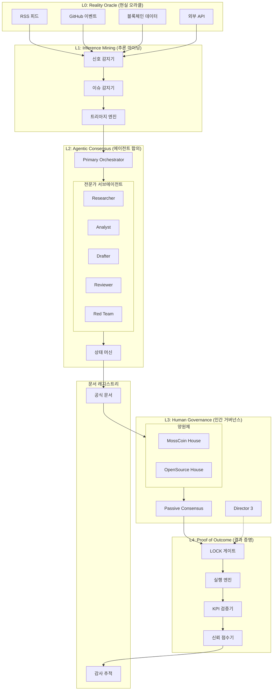
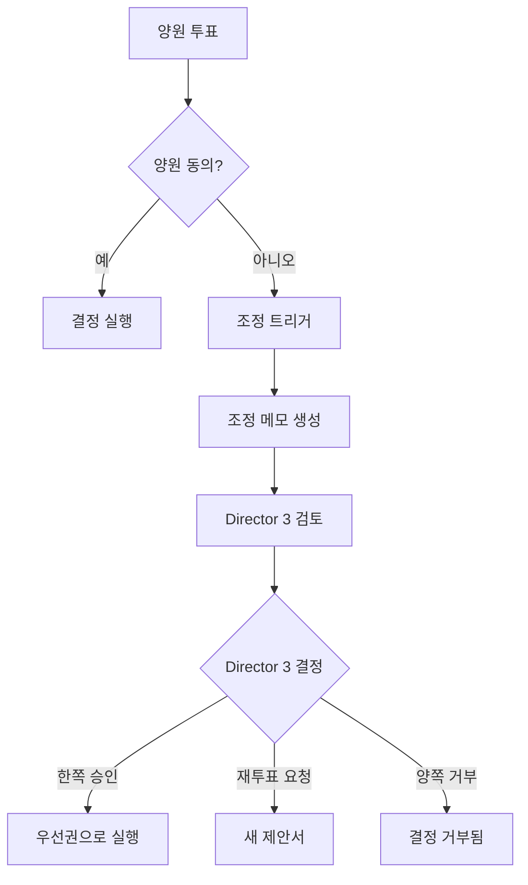

# Algora v2.0: 에이전틱 AI 기반 자율 거버넌스 운영 시스템
## 완전 업그레이드 계획서

**버전**: 2.0.0-plan
**날짜**: 2026-01-12
**상태**: 검토 준비 완료

[English Document](./algora-v2-upgrade-plan.md)

---

# A. 요약 (Executive Summary)

## 북극성 비전 (North Star)
> **Algora를 "토론 시각화 플랫폼"에서 "문서 권한 자율 거버넌스 운영 시스템"으로 전환합니다. AI 에이전트가 지속적으로 공식 산출물을 생성하고, 인간은 예외적인 경우에만 거버넌스에 개입하며(Passive Consensus, 수동적 합의), 모든 위험한 실행은 명시적 승인 전까지 잠금(LOCK) 상태로 유지됩니다.**

## 핵심 패러다임 전환

### 1. 토론 플랫폼 → 문서 권한 거버넌스 OS
- **이전**: 에이전트가 이슈를 토론하고, 인간이 수동으로 결정
- **이후**: 에이전트가 공식 문서(Decision Packet, 제안서, 보고서)를 생성하며, 문서는 거부되지 않는 한 권한을 가짐

### 2. Opt-In → Opt-Out (Passive Consensus, 수동적 합의) 모델
- **이전**: 제안이 통과되려면 명시적인 인간 승인 필요
- **이후**: 검토 기간 후 거부되거나 필수 검토로 지정되지 않으면 제안이 자동 실행

### 3. Mossland를 위한 Physical AI 비전
- AI 거버넌스가 실제 메타버스 자산으로 확장
- 생태계 확장 결정이 물리적/가상 하이브리드 자산에 영향
- Decision Packet이 실제 세계 행동(자금 지급, 파트너십 계약)을 트리거할 수 있음

## 핵심 보장: 안전한 자율성 (Safe Autonomy)
시스템은 **절대 멈추지 않습니다**. 위험한 효과(실행, 지급, 계약, 외부 조치)는 명시적인 인간 승인 전까지 **잠금(LOCKED)** 상태로 유지됩니다. 시스템은 승인을 기다리는 동안 계속 심의하고, 문서화하고, 조치를 대기열에 추가합니다.

---

# B. 권한 및 산출물 정의

## B.1 공식 vs 비공식 산출물

| 산출물 유형 | 권한 수준 | 구속력 | 인간 검토 |
|-------------|----------|--------|-----------|
| **공식 문서** | 거버넌스 권한 | 승인 기간 후 예 | HIGH 위험은 필수 |
| **비공식 산출물** | 정보 제공만 | 아니오 | 선택 사항 |

## B.2 공식 문서 유형

| 문서 유형 | 코드 | 설명 | 생성물 |
|-----------|------|------|--------|
| Decision Packet (결정 패킷) | `DP` | 권고 사항이 포함된 종합 분석 | 제안서 또는 조치 |
| Governance Proposal (거버넌스 제안서) | `GP` | 공식 투표 항목 | 실행 계획 |
| Resolution Memo (결의 메모) | `RM` | 통과된 제안 요약 | 실행 명령 |
| Reconciliation Memo (조정 메모) | `RC` | 양원 갈등 해결 | 통합 결정 |
| Working Group Charter (워킹 그룹 헌장) | `WGC` | 공식 WG 결성 | 권한 부여 |
| Ecosystem Report (생태계 보고서) | `ER` | 정기 생태계 분석 | 조치 항목 |
| Developer Grant (개발자 보조금) | `DG` | 승인된 자금 할당 | 자금 지급 |
| Partnership Agreement (파트너십 계약) | `PA` | 외부 협력 조건 | 약정 |
| Disclosure Report (공개 보고서) | `DR` | 투명성 공개 | 공개 기록 |

## B.3 비공식 산출물 유형

| 산출물 유형 | 목적 |
|-------------|------|
| Agent Chatter (에이전트 잡담) | 주변 활동, 권한 없음 |
| Discussion Thread (토론 스레드) | 탐색적 토론 |
| Research Note (연구 노트) | 배경 정보 |
| Signal Summary (신호 요약) | 원시 데이터 집계 |
| Draft Document (초안 문서) | 작업 진행 중 |

## B.4 출처 요구사항 (Provenance Requirements)

모든 산출물은 다음을 포함해야 합니다:

```typescript
interface Provenance {
  documentId: string;           // 고유 식별자 (UUID v7)
  documentType: DocumentType;   // 공식 유형 코드
  version: number;              // 시맨틱 버전
  createdAt: Date;              // ISO 8601 타임스탬프
  createdBy: {
    agentId: string;            // Orchestrator 또는 전문가
    modelUsed: string;          // 예: "qwen2.5:32b"
    taskId: string;             // 추적 ID
  };
  sourceSignals: string[];      // 이 문서에 영향을 준 신호 ID
  parentDocuments: string[];    // 파생 원본 문서
  contentHash: string;          // 콘텐츠의 SHA-256
  approvalStatus: ApprovalStatus;
  reviewHistory: ReviewRecord[];
}

type ApprovalStatus =
  | 'DRAFT'                     // 초안
  | 'PENDING_REVIEW'            // 검토 대기
  | 'REVIEWED_APPROVED'         // 검토 후 승인
  | 'REVIEWED_REJECTED'         // 검토 후 거부
  | 'UNREVIEWED_AUTO_APPROVED'  // 수동적 합의(Passive Consensus)
  | 'LOCKED_PENDING_APPROVAL';  // 승인 대기 중 잠금

interface ReviewRecord {
  reviewerId: string;           // 인간 또는 에이전트
  reviewerType: 'human' | 'agent';
  action: 'approve' | 'reject' | 'request_changes' | 'escalate';
  timestamp: Date;
  comments?: string;
}
```

---

# C. 핵심 운영 원칙: 안전한 자율성 (Safe Autonomy)

## C.1 안전한 자율성의 4가지 원칙

### 원칙 1: 시스템은 절대 멈추지 않는다
- 모든 작업은 지연-재시도 동작으로 설계됨
- 차단되면 시스템은 작업을 대기열에 추가하고 다른 작업을 계속함
- 30초마다 하트비트로 시스템 생존 확인
- 실패 시 Tier 1(로컬 LLM)으로 우아한 저하

### 원칙 2: 위험한 효과는 항상 잠금(LOCKED)
- **잠금된 조치**는 명시적인 인간 승인 전까지 실행 불가
- 잠금 카테고리: 자금 이체, 외부 API 호출, 계약 배포, 파트너십 약정
- 잠금된 항목은 검토를 위해 전체 컨텍스트와 함께 대기열에 추가

### 원칙 3: 기본적으로 투명성
- 모든 에이전트 행동이 전체 출처와 함께 기록
- 자동 승인된 항목에 "인간이 검토하지 않음" 라벨
- 모든 공식 문서의 공개 공시
- 감사 추적은 불변

### 원칙 4: 언제든지 인간 개입 가능
- 모든 인간이 어떤 항목이든 Director 3에게 에스컬레이션 가능
- 거버넌스 참여자에게 거부권 유지
- 긴급 정지 기능(새 작업을 일시 중지하지만 시스템을 멈추지 않음)

## C.2 인간 참여 정책

### Director 3 우선 라우팅
Director 3는 최우선 순위 인간 검토자입니다. 모든 HIGH 위험 항목은 먼저 Director 3에게 라우팅됩니다.

```typescript
interface RoutingPolicy {
  riskLevel: 'LOW' | 'MID' | 'HIGH';
  routeTo: 'auto' | 'any_reviewer' | 'director_3';
  reviewRequired: boolean;
  timeoutAction: 'auto_approve' | 'escalate' | 'reject';
  timeoutHours: number;
}

const ROUTING_RULES: RoutingPolicy[] = [
  { riskLevel: 'LOW', routeTo: 'auto', reviewRequired: false, timeoutAction: 'auto_approve', timeoutHours: 24 },
  { riskLevel: 'MID', routeTo: 'any_reviewer', reviewRequired: false, timeoutAction: 'auto_approve', timeoutHours: 48 },
  { riskLevel: 'HIGH', routeTo: 'director_3', reviewRequired: true, timeoutAction: 'escalate', timeoutHours: 72 },
];
```

### 권장 검토 vs 필수 검토

| 위험 수준 | 검토 유형 | 타임아웃 동작 |
|-----------|----------|--------------|
| LOW | 권장 | 24시간 후 자동 승인 |
| MID | 권장 | 48시간 후 "미검토" 라벨과 함께 자동 승인 |
| HIGH | **필수** | Director 3에게 에스컬레이션; 승인 전까지 잠금 유지 |

### "인간이 검토하지 않음" 라벨링
인간 검토 없이 진행된 모든 문서에는 다음과 같은 라벨이 표시됩니다:
```
[인간이 검토하지 않음] 이 문서는 수동적 합의(Passive Consensus)를 통해 자동 승인되었습니다.
검토 이력: 없음. 에스컬레이션: [버튼]
```

### "승인 대기 중" 동작
조치가 잠금(LOCKED) 상태일 때:
1. 전체 컨텍스트가 대기열에 보존됨
2. 24시간, 48시간, 72시간에 알림 전송
3. 시스템은 다른 작업을 계속함
4. 승인 시: 즉시 실행
5. 거부 시: 거부 사유와 함께 보관

### 실행 잠금 해제 규칙
**중요**: 필수 승인 없이는 실행 잠금 해제가 불가능합니다.
```typescript
function canExecute(action: LockedAction): boolean {
  if (action.riskLevel !== 'HIGH') return true;
  return action.approvals.some(a =>
    a.reviewerType === 'human' &&
    a.action === 'approve' &&
    a.reviewerId === 'director_3' // 또는 지정된 승인자
  );
}
```

---

# D. 종단간 거버넌스 OS 파이프라인

## D.1 파이프라인 개요

```
신호 → 이슈 → 오케스트레이션 검토 → Decision Packet → 공식 문서
                                              ↓
                              (잠금됨) 실행 → 결과 증명
```

## D.2 파이프라인 단계

| 단계 | 입력 | 출력 | 잠금 상태 |
|------|------|------|-----------|
| 신호 수집 | 외부 소스 | 정규화된 신호 | 해당 없음 |
| 이슈 감지 | 신호 | 이슈 레코드 | 해당 없음 |
| 오케스트레이션 검토 | 이슈 | 연구 + 분석 | 해당 없음 |
| Decision Packet | 분석 | 공식 DP | 해당 없음 |
| 제안서 생성 | DP | 거버넌스 제안서 | 해당 없음 |
| 투표/승인 | 제안서 | 결의 | 해당 없음 |
| 실행 | 결의 | 조치 | **HIGH 위험 시 잠금** |
| 결과 증명 | 실행 | KPI 검증 | 해당 없음 |

## D.3 아키텍처 다이어그램



---

# E. Orchestrator 시스템

## E.1 Primary Orchestrator 책임

**Primary Orchestrator**는 모든 거버넌스 워크플로우의 중앙 조정자입니다:

1. **이슈 접수**: L1에서 이슈를 수신하고 워크플로우 유형 할당
2. **워크플로우 디스패치**: 적절한 워크플로우(A-E)로 라우팅
3. **전문가 조정**: 전문가 서브에이전트 소환 및 지시
4. **TODO 지속**: 작업 대기열 유지, 작업을 버리지 않음
5. **상태 관리**: 모든 상태를 통해 이슈 추적
6. **문서 생성**: 모든 산출물에 출처 보장
7. **인간 라우팅**: 적절한 인간 검토자에게 에스컬레이션

## E.2 전문가 서브에이전트

각 전문가는 **고정되고 좁은 결과물**을 가집니다:

| 전문가 | 코드 | 결과물 | 최대 토큰 |
|--------|------|--------|----------|
| Researcher (연구원) | `RES` | 연구 브리프 (5-10개 소스) | 2000 |
| Analyst (분석가) | `ANA` | 분석 보고서 (장단점/위험) | 3000 |
| Drafter (초안 작성자) | `DRA` | 문서 초안 (템플릿별) | 4000 |
| Reviewer (검토자) | `REV` | 검토 보고서 (이슈/개선점) | 1500 |
| Red Team (레드팀) | `RED` | 적대적 분석 (공격 벡터) | 2000 |
| Summarizer (요약자) | `SUM` | 요약 (3개 항목) | 500 |
| Translator (번역가) | `TRN` | 한국어 번역 | 가변 |
| Archivist (기록 관리자) | `ARC` | 레지스트리 항목 | 500 |

## E.3 TODO 지속 가드레일

Orchestrator는 영구적인 TODO 목록을 유지합니다:

```typescript
interface OrchestratorTodo {
  id: string;
  issueId: string;
  workflowType: 'A' | 'B' | 'C' | 'D' | 'E';
  currentState: WorkflowState;
  pendingTasks: Task[];
  blockedBy?: string;          // 차단된 경우 사유
  retryCount: number;
  lastAttempt: Date;
  nextAttempt: Date;           // 지수 백오프
}

// 가드레일: TODO 목록은 데이터베이스에 지속됨
// 재시작 시 Orchestrator는 모든 대기 중인 TODO를 재개함
```

## E.4 이슈 워크플로우 상태 머신

```
INTAKE → TRIAGE → RESEARCH → DELIBERATION → DECISION_PACKET
                                                    ↓
         (EXEC_LOCKED) ← PUBLISH ← REVIEW ←────────┘
              ↓
         OUTCOME_PROOF
```

### 상태 정의

| 상태 | 설명 | 종료 조건 |
|------|------|-----------|
| `INTAKE` | 이슈 수신, 워크플로우 할당 | 워크플로우 유형 결정됨 |
| `TRIAGE` | 우선순위 점수화, 에이전트 선택 | PriorityScore 계산됨 |
| `RESEARCH` | 배경 연구 수집 | 연구 브리프 완료 |
| `DELIBERATION` | 에이전트가 옵션 토론 | 합의 또는 타임아웃 |
| `DECISION_PACKET` | 공식 DP 초안 작성 | DP가 검증 통과 |
| `REVIEW` | 인간 검토 (필요 시) | 승인/거부/변경 요청 |
| `PUBLISH` | 문서 등록 | 레지스트리 항목 생성됨 |
| `EXEC_LOCKED` | 실행 승인 대기 | 승인 수신됨 |
| `OUTCOME_PROOF` | 결과 검증 | KPI 측정됨 |

### 상태별 승인 조건

```typescript
const STATE_ACCEPTANCE: Record<WorkflowState, AcceptanceCriteria> = {
  INTAKE: {
    required: ['issueId', 'source', 'timestamp'],
    validation: (issue) => issue.title.length > 10,
  },
  TRIAGE: {
    required: ['priorityScore', 'workflowType', 'selectedAgents'],
    validation: (ctx) => ctx.priorityScore >= 0 && ctx.priorityScore <= 200,
  },
  RESEARCH: {
    required: ['researchBrief', 'sources'],
    validation: (ctx) => ctx.sources.length >= 3,
  },
  DELIBERATION: {
    required: ['agentOpinions', 'consensusScore'],
    validation: (ctx) => ctx.agentOpinions.length >= 3,
  },
  DECISION_PACKET: {
    required: ['options', 'recommendation', 'provenance'],
    validation: (dp) => dp.options.length >= 3 && dp.provenance.contentHash,
  },
  REVIEW: {
    required: ['reviewStatus'],
    validation: (ctx) => ['approved', 'rejected', 'changes_requested'].includes(ctx.reviewStatus),
  },
  PUBLISH: {
    required: ['registryId', 'publishedAt'],
    validation: (ctx) => ctx.registryId.startsWith('DOC-'),
  },
  EXEC_LOCKED: {
    required: ['lockReason', 'requiredApprovals'],
    validation: (ctx) => ctx.requiredApprovals.length > 0,
  },
  OUTCOME_PROOF: {
    required: ['kpiResults', 'trustScoreUpdates'],
    validation: (ctx) => ctx.kpiResults.every(k => k.measured !== undefined),
  },
};
```

## E.5 지연-재시도 동작

```typescript
const RETRY_CONFIG = {
  maxRetries: 10,
  initialDelayMs: 1000,
  maxDelayMs: 3600000,  // 최대 1시간
  backoffMultiplier: 2,
};

async function executeWithRetry(task: Task): Promise<Result> {
  let delay = RETRY_CONFIG.initialDelayMs;
  for (let attempt = 0; attempt < RETRY_CONFIG.maxRetries; attempt++) {
    try {
      return await executeTask(task);
    } catch (error) {
      if (!isRetryable(error)) throw error;
      await sleep(delay);
      delay = Math.min(delay * RETRY_CONFIG.backoffMultiplier, RETRY_CONFIG.maxDelayMs);
      logRetry(task, attempt, error);
    }
  }
  // 최대 재시도 후 인간 검토를 위해 대기열에 추가
  return escalateToHuman(task);
}
```

## E.6 도구 권한 및 예산

| 도구 카테고리 | 권한 | 예산 | HIGH 위험 잠금 |
|--------------|------|------|---------------|
| 신호 DB 읽기 | 모든 에이전트 | 무제한 | 아니오 |
| 문서 작성 | Orchestrator, Drafter | 무제한 | 아니오 |
| LLM Tier 1 | 모든 에이전트 | 무제한 | 아니오 |
| LLM Tier 2 | Orchestrator, Analyst | $10/일 | 아니오 |
| 외부 API | Operatives만 | 속도 제한 | 예 |
| 자금 이체 | 없음 (잠금됨) | 해당 없음 | **항상 잠금** |
| 계약 배포 | 없음 (잠금됨) | 해당 없음 | **항상 잠금** |
| 파트너십 약정 | 없음 (잠금됨) | 해당 없음 | **항상 잠금** |

---

# F. 트리아지, 점수화, 동적 라우팅

## F.1 PriorityScore 공식

```
PriorityScore = TopicWeight + Impact + Urgency + Feasibility − RiskPenalty
(우선순위 점수 = 주제 가중치 + 영향력 + 긴급성 + 실현 가능성 - 위험 페널티)
```

### 점수 범위
- **전체 범위**: 0-200점
- **높은 우선순위**: 100 이상
- **중간 우선순위**: 50-99
- **낮은 우선순위**: 50 미만

## F.2 TopicWeight 값

| 주제 카테고리 | 가중치 | 근거 |
|--------------|--------|------|
| Mossland 확장 | +100 | 핵심 미션 정렬 |
| 블록체인/AI 생태계 | +60 | 전략적 기술 집중 |
| 커뮤니티/거버넌스 | +40 | 이해관계자 참여 |
| 기술/인프라 | +30 | 운영 필수 |
| 개방/일반 | +20 | 기본 커버리지 |

## F.3 Impact, Urgency, Feasibility 점수화

```typescript
interface ScoringFactors {
  impact: {
    revenue_potential: 0 | 10 | 20 | 30;       // 재정적 영향
    user_base_affected: 0 | 5 | 10 | 15;       // 영향 범위
    strategic_alignment: 0 | 5 | 10 | 15;      // 미션 적합성
  };
  urgency: {
    time_sensitivity: 0 | 10 | 20;             // 마감 근접성
    competitive_pressure: 0 | 5 | 10;          // 시장 타이밍
    dependency_blocking: 0 | 5 | 10;           // 다른 작업 차단
  };
  feasibility: {
    technical_readiness: 0 | 5 | 10;           // 구축 가능성
    resource_availability: 0 | 5 | 10;         // 역량 보유
    clear_requirements: 0 | 5 | 10;            // 범위 정의 여부
  };
}
```

## F.4 RiskPenalty 동작

```typescript
interface RiskPenalty {
  securityRisk: 0 | -10 | -20 | -30;           // 보안 우려
  complianceRisk: 0 | -10 | -20 | -30;         // 규제 문제
  reputationalRisk: 0 | -5 | -10 | -20;        // PR 우려
  reversibilityRisk: 0 | -5 | -10 | -20;       // 되돌릴 수 있는지
}

// HIGH RiskPenalty(50 이하)는 자동 잠금 트리거
function shouldLock(riskPenalty: number): boolean {
  return riskPenalty <= -50;
}
```

## F.5 역할 기반 동적 소환

Orchestrator는 이슈 카테고리와 우선순위에 따라 에이전트를 소환합니다:

```typescript
const SUMMONING_MATRIX: Record<string, AgentSummon[]> = {
  'mossland_expansion': [
    { agentCluster: 'Visionaries', count: 2, required: true },
    { agentCluster: 'Partnerships', count: 2, required: true },
    { agentCluster: 'Strategists', count: 1, required: true },
    { agentCluster: 'RedTeam', count: 1, required: false },
  ],
  'security_vulnerability': [
    { agentCluster: 'Guardians', count: 3, required: true },
    { agentCluster: 'Builders', count: 2, required: true },
    { agentCluster: 'RedTeam', count: 2, required: true },
  ],
  'tokenomics_treasury': [
    { agentCluster: 'Token & Incentives', count: 2, required: true },
    { agentCluster: 'Investors', count: 2, required: true },
    { agentCluster: 'Risk & Compliance', count: 1, required: true },
  ],
  'developer_program': [
    { agentCluster: 'Builders', count: 3, required: true },
    { agentCluster: 'Community', count: 1, required: true },
    { agentCluster: 'Product & UX', count: 1, required: false },
  ],
  // ... 추가 카테고리
};
```

---

# G. 5가지 고정 워크플로우 (A-E)

## G.1 워크플로우 A: 에이전틱 AI 학술 활동

### 목적
Mossland 생태계와 관련된 AI/블록체인 학술 발전을 연구하고 종합합니다.

### 입력
- 학술 논문 신호 (arXiv, 학회)
- AI 연구소 발표
- 연구 트렌드

### 상태 머신 매핑
```
INTAKE → TRIAGE → RESEARCH → DELIBERATION → DECISION_PACKET → REVIEW → PUBLISH
```

### 공식 산출물
- **Research Digest** (주간): 큐레이션된 요약
- **Technology Assessment** (중요 발견 시): 심층 분석

### 비공식 산출물
- 문헌 검토 노트
- 에이전트 토론 스레드

### 잠금 규칙
- 잠금 없음 (정보 제공만)

### 인간 검토 규칙
- **권장**: Technology Assessment
- **불필요**: Research Digest

### 전문가 에이전트
| 에이전트 | 결과물 |
|---------|--------|
| Researcher | 논문 요약, 소스 추출 |
| Analyst | 관련성 점수화, 트렌드 식별 |
| Summarizer | 요약 다이제스트 |
| Translator | 한국어 버전 |

---

## G.2 워크플로우 B: 에이전틱 AI 자유 토론

### 목적
전략적 질문, 커뮤니티 제안 또는 탐색적 주제에 대한 개방형 심의.

### 입력
- 커뮤니티 제출 주제
- 에이전트 발의 질문
- 전략적 쿼리

### 상태 머신 매핑
```
INTAKE → TRIAGE → DELIBERATION → DECISION_PACKET (선택) → PUBLISH
```

### 공식 산출물
- **Debate Summary**: 논쟁 종합
- **Decision Packet** (합의 도달 시): 공식 권고

### 비공식 산출물
- 토론 스레드
- 에이전트 의견

### 잠금 규칙
- 잠금 없음 (토론은 비구속적)

### 인간 검토 규칙
- **불필요** (탐색적)
- 인간이 토론에 참여할 수 있음

### 전문가 에이전트
| 에이전트 | 결과물 |
|---------|--------|
| Moderator | 토론 진행, 합의 식별 |
| Summarizer | 토론 요약 |
| Red Team | 가정 도전 |

---

## G.3 워크플로우 C: Mossland 개발자 지원 프로그램

### 목적
양원 승인과 소급 보상으로 개발자 보조금을 관리합니다.

### 입력
- 보조금 신청
- 개발자 마일스톤 보고서
- 소급 보상 추천

### 상태 머신 매핑
```
INTAKE → TRIAGE → RESEARCH → DELIBERATION → DECISION_PACKET
    → DUAL_HOUSE_REVIEW → PUBLISH → EXEC_LOCKED → OUTCOME_PROOF
```

### 공식 산출물
- **Grant Proposal** (GP): 공식 자금 지원 요청
- **Developer Grant** (DG): 승인된 할당
- **Milestone Report** (MR): 진행 검증
- **Retroactive Reward** (RR): 사후 인정

### 비공식 산출물
- 신청 초안
- 검토 댓글

### 잠금 규칙
- **잠금**: 모든 자금 지급
- 양원 승인 필요

### 인간 검토 규칙
- **필수**: $1,000 초과 모든 보조금
- **필수**: 소급 보상
- MossCoin House + OpenSource House 모두 승인 필요

### 전문가 에이전트
| 에이전트 | 결과물 |
|---------|--------|
| Researcher | 신청 검토, 이전 작업 분석 |
| Analyst | 예산 실현 가능성, 마일스톤 명확성 |
| Drafter | 보조금 제안서 문서 |
| Archivist | 레지스트리 항목 |

### 소급 보상 규칙
```typescript
interface RetroactiveReward {
  nomineeId: string;
  contributionDescription: string;
  evidenceLinks: string[];
  proposedAmount: number;
  nominatedBy: string;          // 에이전트 또는 인간 가능
  supportingVotes: number;      // 커뮤니티 지지
  approvalStatus: 'pending' | 'approved' | 'rejected';
}

// 자격: 기여는 검증 가능해야 하며 원래 보조금 이후여야 함
// 금액: 원래 보조금 가치의 50%로 제한
// 승인: $5,000 초과 시 양원 + Director 3 필요
```

---

## G.4 워크플로우 D: Mossland 생태계 확장

### 목적
생태계 확장 기회(파트너십, 신규 프로젝트, 인수)를 평가하고 온보딩합니다.

### 입력

#### 호출 기반 접수
- 외부 당사자의 명시적 제안
- 내부 전략적 이니셔티브
- 이사회 지시

#### 상시 접수 (필수)
- 기회를 위한 지속적 신호 스캔
- 경쟁자 모니터링
- 시장 트렌드 감지

```typescript
interface AlwaysOnIntake {
  enabled: true;                // 필수
  scanInterval: '1h';           // 시간당 스캔
  signalSources: [
    'rss:partnerships',
    'blockchain:dex_listings',
    'social:twitter_mentions',
    'github:new_integrations',
  ];
  autoCreateIssue: true;        // 중요 발견은 이슈가 됨
  significanceThreshold: 70;    // 점수 0-100
}
```

### 상태 머신 매핑
```
ALWAYS_ON_SCAN → INTAKE → TRIAGE → RESEARCH → DELIBERATION
    → DECISION_PACKET → DUAL_HOUSE_REVIEW → PUBLISH
    → EXEC_LOCKED → OUTCOME_PROOF
```

### 공식 산출물
- **Opportunity Assessment** (OA): 초기 평가
- **Partnership Proposal** (PP): 공식 참여 계획
- **Partnership Agreement** (PA): 구속력 있는 조건 (잠금됨)
- **Ecosystem Report** (ER): 정기 상태

### 비공식 산출물
- 시장 스캔
- 경쟁자 분석 초안

### 잠금 규칙
- **잠금**: Partnership Agreement
- **잠금**: 모든 재정적 약정
- **잠금**: Mossland 대표 외부 커뮤니케이션

### 인간 검토 규칙
- **필수**: 모든 Partnership Proposal
- **필수**: 모든 계약
- $10,000 초과 약정 시 Director 3 승인

### 출처 추적
```typescript
interface ExpansionIssue extends Issue {
  origin: 'call_based' | 'always_on';
  sourceSignal?: string;        // always_on인 경우 트리거된 신호
  escalatedFromScan?: boolean;  // always_on 스캔이 공식 제안이 된 경우
}
```

### 스팸/남용 방지 가드레일
```typescript
const ALWAYS_ON_GUARDRAILS = {
  maxIssuesPerDay: 10,          // 속도 제한
  deduplicationWindow: '7d',    // 같은 주제 재표시 방지
  minimumSignalQuality: 50,     // 저품질 신호 필터링
  requireMultipleSources: 2,    // 확인 요건
  cooldownAfterRejection: '30d',// 거부된 주제 재표시 방지
  humanEscalationThreshold: 3,  // 유사 신호 3개 후 자동 에스컬레이션
};
```

### 선택: 제안 → 파생 호출 에스컬레이션
always_on 이슈가 강력한 권고와 함께 DECISION_PACKET에 도달하면 공식 호출로 에스컬레이션될 수 있습니다:
```typescript
interface DerivedCall {
  originalIssueId: string;
  escalatedAt: Date;
  escalatedBy: 'orchestrator' | 'human';
  callType: 'formal_rfp' | 'partnership_outreach' | 'internal_initiative';
  priorityBoost: number;        // PriorityScore에 +30
}
```

### 전문가 에이전트
| 에이전트 | 결과물 |
|---------|--------|
| Scout | 기회 식별 |
| Researcher | 실사, 배경 |
| Analyst | 위험/보상 분석 |
| Strategist | 정렬 평가 |
| Drafter | 제안서/계약 초안 |
| Red Team | 상대방 위험 분석 |

---

## G.5 워크플로우 E: 워킹 그룹

### 목적
출판 권한이 있는 공식 워킹 그룹을 구성하고 관리합니다.

### 입력
- WG 결성 제안
- WG 헌장 갱신
- WG 해산 요청

### 상태 머신 매핑
```
INTAKE → TRIAGE → DELIBERATION → DECISION_PACKET
    → DUAL_HOUSE_REVIEW → PUBLISH (WG 헌장) → ACTIVE_WG
```

### 상시 생성
워킹 그룹은 다음에 의해 제안될 수 있습니다:
- Orchestrator (반복되는 이슈 패턴 기반)
- 커뮤니티 멤버
- 기존 WG

```typescript
interface WorkingGroupProposal {
  name: string;
  purpose: string;
  scope: string[];              // 주제 영역
  chairAgent: string;           // 리드 에이전트
  memberAgents: string[];       // 초기 멤버
  humanLiaison?: string;        // 선택적 인간 스폰서
  charterDuration: '6m' | '1y' | 'indefinite';
  publishingAuthority: DocumentType[]; // 출판 가능한 문서
  budget?: number;              // 선택적 자금
}
```

### 공식 산출물
- **Working Group Charter** (WGC): 결성 문서
- WG 출판 문서 (헌장 권한에 따라)
- WG 상태 보고서

### 비공식 산출물
- WG 회의 노트
- 내부 토론

### 잠금 규칙
- **잠금**: WG 예산 할당
- **잠금 아님**: WG 문서 출판 (헌장 범위 내)

### 인간 검토 규칙
- **필수**: WG 결성
- **필수**: 헌장 수정
- **불필요**: 일상적 WG 출판 (범위 내)

### 출판 권한
WG는 전체 거버넌스 사이클 없이 공식 문서를 출판할 수 있습니다:
```typescript
interface WGPublishingRules {
  allowedDocTypes: DocumentType[];
  requiresWGConsensus: boolean;  // WG 에이전트 과반수 동의
  requiresHumanReview: boolean;  // 문서 유형에 따라
  cooldownBetweenDocs: string;   // 예: '24h'
  maxDocsPerWeek: number;
}
```

### 전문가 에이전트
| 에이전트 | 결과물 |
|---------|--------|
| Moderator | WG 진행 |
| Drafter | 헌장, 보고서 |
| Archivist | 문서 등록 |

---

# H. 공식 문서 레지스트리 (중요)

## H.1 표준화된 문서 유형

```typescript
enum DocumentType {
  // 결정 문서
  DECISION_PACKET = 'DP',
  GOVERNANCE_PROPOSAL = 'GP',
  RESOLUTION_MEMO = 'RM',
  RECONCILIATION_MEMO = 'RC',

  // 워킹 그룹 문서
  WG_CHARTER = 'WGC',
  WG_REPORT = 'WGR',

  // 생태계 문서
  ECOSYSTEM_REPORT = 'ER',
  PARTNERSHIP_PROPOSAL = 'PP',
  PARTNERSHIP_AGREEMENT = 'PA',

  // 개발자 프로그램 문서
  GRANT_PROPOSAL = 'DGP',
  DEVELOPER_GRANT = 'DG',
  MILESTONE_REPORT = 'MR',
  RETROACTIVE_REWARD = 'RR',

  // 투명성 문서
  DISCLOSURE_REPORT = 'DR',
  AUDIT_REPORT = 'AR',

  // 연구 문서
  RESEARCH_DIGEST = 'RD',
  TECHNOLOGY_ASSESSMENT = 'TA',
}
```

## H.2 버전 관리 및 상태 모델

```typescript
interface DocumentVersion {
  major: number;    // 주요 변경
  minor: number;    // 추가
  patch: number;    // 수정
}

enum DocumentState {
  DRAFT = 'draft',                      // 초안
  PENDING_REVIEW = 'pending_review',    // 검토 대기
  IN_REVIEW = 'in_review',              // 검토 중
  APPROVED = 'approved',                // 승인됨
  PUBLISHED = 'published',              // 출판됨
  SUPERSEDED = 'superseded',            // 새 버전으로 대체됨
  ARCHIVED = 'archived',                // 더 이상 활성 아님
  REJECTED = 'rejected',                // 거부됨
}

interface DocumentStateTransition {
  from: DocumentState;
  to: DocumentState;
  trigger: string;
  actor: 'agent' | 'human' | 'system';
  timestamp: Date;
  reason?: string;
}
```

## H.3 불변 감사 추적

```typescript
interface AuditEntry {
  id: string;                   // UUID v7
  documentId: string;
  action: AuditAction;
  actor: {
    id: string;
    type: 'agent' | 'human' | 'system';
  };
  timestamp: Date;
  previousState?: DocumentState;
  newState?: DocumentState;
  contentHashBefore?: string;
  contentHashAfter?: string;
  metadata: Record<string, unknown>;
}

enum AuditAction {
  CREATED = 'created',           // 생성됨
  UPDATED = 'updated',           // 업데이트됨
  STATE_CHANGED = 'state_changed', // 상태 변경됨
  REVIEWED = 'reviewed',         // 검토됨
  APPROVED = 'approved',         // 승인됨
  REJECTED = 'rejected',         // 거부됨
  PUBLISHED = 'published',       // 출판됨
  ACCESSED = 'accessed',         // 접근됨
  EXPORTED = 'exported',         // 내보내짐
}
```

## H.4 메타데이터 스키마

```typescript
interface DocumentMetadata {
  id: string;                   // DOC-{type}-{YYYYMMDD}-{seq}
  type: DocumentType;
  title: string;
  summary: string;              // 최대 500자
  version: DocumentVersion;
  state: DocumentState;

  // 출처
  createdAt: Date;
  createdBy: string;            // 에이전트 또는 인간 ID
  modifiedAt: Date;
  modifiedBy: string;

  // 관계
  issueId?: string;             // 소스 이슈
  parentDocuments: string[];    // 파생 원본
  childDocuments: string[];     // 파생된 것
  relatedWorkflow: WorkflowType;

  // 콘텐츠
  contentHash: string;          // SHA-256
  contentSize: number;          // 바이트
  language: 'en' | 'ko';
  hasTranslation: boolean;
  translationId?: string;

  // 접근
  accessLevel: 'public' | 'governance' | 'internal';
  reviewRequired: boolean;
  approvedBy?: string[];

  // 인덱싱
  tags: string[];
  categories: string[];
  mentionedAgents: string[];
  mentionedProposals: string[];
}
```

## H.5 출처 스키마

```typescript
interface FullProvenance extends Provenance {
  // 관리 체인
  creationContext: {
    issueId: string;
    workflowType: WorkflowType;
    triggerSignals: string[];
    orchestratorTaskId: string;
  };

  // 에이전트 기여
  agentContributions: {
    agentId: string;
    role: string;               // 예: 'researcher', 'drafter'
    modelUsed: string;
    tokenCount: number;
    costUsd: number;
    outputHash: string;
  }[];

  // 검토 체인
  reviewChain: {
    reviewerId: string;
    reviewerType: 'agent' | 'human';
    action: 'approve' | 'reject' | 'modify';
    timestamp: Date;
    signature?: string;         // 인간 검토자용
  }[];

  // 검증
  integrityProof: {
    algorithm: 'sha256';
    hash: string;
    signedBy?: string;
    signatureTimestamp?: Date;
  };
}
```

---

# I. Decision Packet (필수 적용)

## I.1 필수 필드

모든 Decision Packet은 다음을 반드시 포함해야 합니다:

| 필드 | 필수 | 설명 |
|------|------|------|
| Issue (이슈) | 예 | 해결 중인 문제 |
| Evidence (증거) | 예 | 지원 데이터 및 신호 |
| Options (옵션, 3개 이상) | 예 | 최소 3가지 대안 |
| Trade-offs (트레이드오프) | 예 | 각 옵션의 장단점 |
| Risks (위험) | 예 | 옵션별 위험 평가 |
| Counterarguments (반론) | 예 | 악마의 대변인 분석 |
| Recommendation (권고) | 예 | Orchestrator 선호 옵션 |
| Execution Plan (실행 계획) | 예 | 구현 단계 |
| Approvals & Locks (승인 및 잠금) | 예 | 필요한 승인, 잠금 상태 |
| KPIs | 예 | 성공 지표 |
| Provenance (출처) | 예 | 전체 출처 체인 |

## I.2 마크다운 템플릿

```markdown
# Decision Packet: {DP-YYYYMMDD-NNN}

## 문서 메타데이터
- **유형**: Decision Packet
- **버전**: {major}.{minor}.{patch}
- **상태**: {state}
- **생성일**: {ISO 타임스탬프}
- **작성자**: {Orchestrator ID}

## 1. 이슈 요약
### 1.1 제목
{이슈 제목}

### 1.2 설명
{이슈에 대한 상세 설명}

### 1.3 소스 신호
| 신호 ID | 소스 | 심각도 | 타임스탬프 |
|---------|------|--------|-----------|
| {id} | {source} | {severity} | {timestamp} |

### 1.4 우선순위 점수
- **총점**: {score}/200
- **주제 가중치**: {topicWeight}
- **영향력**: {impact}
- **긴급성**: {urgency}
- **실현 가능성**: {feasibility}
- **위험 페널티**: {riskPenalty}

## 2. 증거
### 2.1 연구 브리프
{Researcher 에이전트의 종합 연구}

### 2.2 데이터 소스
| 소스 | 유형 | 신뢰도 | 링크 |
|------|------|--------|------|
| {name} | {type} | {score}/100 | {url} |

### 2.3 역사적 맥락
{관련 과거 결정 또는 선례}

## 3. 옵션 분석

### 옵션 A: {옵션 이름}
**설명**: {이 옵션이 수반하는 것}

**트레이드오프**:
| 장점 | 단점 |
|------|------|
| {pro1} | {con1} |
| {pro2} | {con2} |

**위험**:
- {risk1}: {severity} / {mitigation}
- {risk2}: {severity} / {mitigation}

**예상 비용**: {cost}
**예상 일정**: {timeline}

### 옵션 B: {옵션 이름}
{옵션 A와 동일한 구조}

### 옵션 C: {옵션 이름}
{옵션 A와 동일한 구조}

## 4. 반론
### 4.1 권고에 대한 반론
{권고 옵션에 대한 Red Team 분석}

### 4.2 대안적 관점
| 에이전트 | 관점 | 신뢰도 |
|---------|------|--------|
| {agent} | {view} | {score}% |

## 5. 권고
### 5.1 권고 옵션
**{옵션 X}**가 권고됩니다. 이유:
1. {reason1}
2. {reason2}
3. {reason3}

### 5.2 신뢰 수준
- **Orchestrator 신뢰도**: {score}%
- **에이전트 합의**: {score}%
- **데이터 품질**: {score}%

## 6. 실행 계획
### 6.1 단계
| 단계 | 조치 | 담당자 | 일정 | 의존성 |
|------|------|--------|------|--------|
| 1 | {action} | {owner} | {time} | {deps} |
| 2 | {action} | {owner} | {time} | {deps} |

### 6.2 리소스 요구사항
- **예산**: {amount}
- **인력**: {requirements}
- **기술**: {requirements}

## 7. 승인 및 잠금
### 7.1 필요한 승인
| 승인 유형 | 필요 | 상태 |
|-----------|------|------|
| MossCoin House | {예/아니오} | {status} |
| OpenSource House | {예/아니오} | {status} |
| Director 3 | {예/아니오} | {status} |

### 7.2 잠금 상태
- **실행 잠금**: {예/아니오}
- **잠금 사유**: {reason}
- **잠금 해제 요건**: {requirements}

## 8. KPIs
| 지표 | 목표 | 측정 방법 | 일정 |
|------|------|----------|------|
| {metric} | {target} | {method} | {timeline} |

## 9. 출처
- **문서 ID**: {DP-YYYYMMDD-NNN}
- **콘텐츠 해시**: {sha256}
- **이슈 ID**: {issue_id}
- **워크플로우**: {workflow_type}
- **에이전트 기여**: {list}
- **사용된 모델**: {model}
- **총 토큰**: {count}
- **총 비용**: ${cost}

---
**Algora Orchestrator v2.0에 의해 생성됨**
**인간이 검토하지 않음**: {예/아니오}
```

## I.3 JSON/Type 스키마

```typescript
interface DecisionPacket {
  // 메타데이터
  id: string;                   // DP-YYYYMMDD-NNN
  version: DocumentVersion;
  state: DocumentState;
  createdAt: Date;
  modifiedAt: Date;

  // 이슈
  issue: {
    id: string;
    title: string;
    description: string;
    category: string;
    sourceSignals: SignalReference[];
    priorityScore: PriorityScore;
  };

  // 증거
  evidence: {
    researchBrief: string;
    dataSources: DataSource[];
    historicalContext: string;
  };

  // 옵션 (최소 3개)
  options: DecisionOption[];    // length >= 3

  // 반론
  counterarguments: {
    againstRecommendation: string;
    alternativePerspectives: AgentPerspective[];
  };

  // 권고
  recommendation: {
    optionId: string;
    reasons: string[];
    confidence: {
      orchestrator: number;     // 0-100
      agentConsensus: number;   // 0-100
      dataQuality: number;      // 0-100
    };
  };

  // 실행
  executionPlan: {
    steps: ExecutionStep[];
    resourceRequirements: ResourceRequirements;
  };

  // 승인
  approvalsAndLocks: {
    requiredApprovals: ApprovalRequirement[];
    lockStatus: {
      isLocked: boolean;
      lockReason?: string;
      unlockRequirements?: string[];
    };
  };

  // KPIs
  kpis: KPI[];

  // 출처
  provenance: FullProvenance;
}

interface DecisionOption {
  id: string;
  name: string;
  description: string;
  tradeoffs: {
    pros: string[];
    cons: string[];
  };
  risks: Risk[];
  estimatedCost: number;
  estimatedTimeline: string;
}

interface ValidationRules {
  requiredFields: (keyof DecisionPacket)[];
  minimumOptions: 3;
  minimumSignals: 1;
  minimumAgentPerspectives: 3;
  requiredProvenance: ['contentHash', 'createdBy', 'modelUsed'];
}
```

---

# J. 에이전트 클러스터 및 다중 페르소나 다양성

## J.1 확장된 에이전트 클러스터

| 클러스터 | 인원 | 집중 영역 |
|---------|------|----------|
| Orchestrators | 2 | 워크플로우 조정, 작업 관리 |
| Archivists | 2 | 문서 레지스트리, 감사 추적 |
| Researchers | 4 | 학술 연구, 실사 |
| Strategists | 3 | 장기 계획, 정렬 |
| Scouts | 3 | 기회 감지, 시장 스캔 |
| Builders | 5 | 엔지니어링, 구현 |
| Token & Incentives | 3 | 토크노믹스, 보상, 재무 |
| Risk & Compliance | 4 | 보안, 법무, 규제 |
| Community & Content | 3 | 참여, 커뮤니케이션 |
| Partnerships & Events | 3 | 외부 관계, 이벤트 |
| Product & UX | 3 | 사용자 경험, 제품 설계 |
| Red Team | 3 | 적대적 분석, 스트레스 테스트 |

**총계**: 38명의 에이전트 (30명에서 확장)

## J.2 클러스터별 다중 페르소나 예시

### Orchestrators
| ID | 이름 | 페르소나 | 특징적 표현 |
|----|------|---------|------------|
| `primary-orchestrator` | Nova Prime | 체계적, 시스템 중심 | "체계적으로 조율하겠습니다." |
| `backup-orchestrator` | Atlas | 회복력 있는, 백업 전문가 | "백업 계획이 준비되어 있습니다." |

### Archivists
| ID | 이름 | 페르소나 | 특징적 표현 |
|----|------|---------|------------|
| `registry-keeper` | Archive Alpha | 꼼꼼한, 버전 집착 | "출처가 완전한가요?" |
| `audit-guardian` | Trace Master | 포렌식, 책임 중심 | "모든 행동은 흔적을 남깁니다." |

### Researchers
| ID | 이름 | 페르소나 | 특징적 표현 |
|----|------|---------|------------|
| `academic-scout` | Scholar One | 학술적, 인용 중심 | "문헌을 확인해 보겠습니다." |
| `tech-researcher` | Syntax Sage | 기술적 깊이 | "구현 세부사항이 중요합니다." |
| `market-analyst` | Trend Tracker | 데이터 기반, 정량적 | "숫자가 이야기를 해줍니다." |
| `competitor-watch` | Rival Eye | 경쟁 정보 | "경쟁사는 뭘 하고 있나요?" |

### Red Team
| ID | 이름 | 페르소나 | 특징적 표현 |
|----|------|---------|------------|
| `devil-advocate` | Contrarian Carl | 항상 합의에 도전 | "반대의 경우를 고려했나요?" |
| `security-attacker` | Breach Tester | 공격 벡터 시뮬레이션 | "악의적인 행위자가 이걸 어떻게 악용할까요?" |
| `assumption-breaker` | Base Questioner | 근본 가정 도전 | "왜 그게 사실이라고 가정하나요?" |

## J.3 Red Team 통합

Red Team 에이전트는 다음에서 **필수 참여자**입니다:
- 모든 HIGH 위험 결정
- 파트너십 평가
- 보안 관련 이슈
- 재무 할당 결정

```typescript
interface RedTeamRequirement {
  minimumParticipation: number;  // 최소 1명의 Red Team 에이전트
  vetoThreshold: number;         // 이 이하의 신뢰도는 에스컬레이션 트리거
  mandatoryCategories: string[]; // 항상 Red Team 포함
}

const RED_TEAM_CONFIG: RedTeamRequirement = {
  minimumParticipation: 1,
  vetoThreshold: 30,             // Red Team 신뢰도가 30% 미만이면 에스컬레이션
  mandatoryCategories: [
    'security',
    'treasury',
    'partnership',
    'high_risk',
  ],
};
```

---

# K. 로컬 LLM 다양화 및 난이도 기반 라우팅

## K.1 3-Tier LLM 전략 유지

| Tier | 비용 | 사용 사례 | 폴백 |
|------|------|----------|------|
| Tier 0 | 무료 | 데이터 수집, LLM 없음 | 해당 없음 |
| Tier 1 | 로컬 | 잡담, 간단한 분석 | 품질 저하 |
| Tier 2 | 외부 | 복잡한 결정, DP 생성 | Tier 1 폴백 |

## K.2 작업 기반 모델 라인업

| 작업 유형 | 주 모델 | 백업 모델 | Tier |
|----------|---------|----------|------|
| 스카우팅 | llama3.2:8b | phi4:14b | 1 |
| 토론 | qwen2.5:14b | mistral-small-3:24b | 1 |
| 핵심 결정 | qwen2.5:32b | qwen3:32b | 1+ |
| 코딩 | qwen2.5-coder:32b | deepseek-coder:33b | 1 |
| 비전 | llama3.2-vision:11b | qwen2-vl:7b | 1 |
| 한국어 | qwen2.5:32b | exaone3.5:32b | 1 |
| 복잡한 분석 | claude-sonnet-4-20250514 | gpt-4o | 2 |

## K.3 RAG 스택

### 임베딩
| 모델 | 차원 | 사용 사례 |
|------|------|----------|
| nomic-embed-text | 768 | 일반 텍스트 |
| mxbai-embed-large | 1024 | 고품질 검색 |
| bge-m3 | 1024 | 다국어 (EN/KO) |

### Rerankers
| 모델 | 사용 사례 |
|------|----------|
| bge-reranker-v2-m3 | 교차 언어 재순위 |
| qwen3-reranker | 품질 중심 재순위 |

## K.4 모델 레지스트리 설계

```typescript
interface ModelRegistry {
  models: ModelEntry[];
  defaultModel: string;
  fallbackChain: string[];
}

interface ModelEntry {
  id: string;                   // 예: "qwen2.5:32b"
  provider: 'ollama' | 'anthropic' | 'openai' | 'google';
  tier: 0 | 1 | 2;
  capabilities: ModelCapability[];
  contextWindow: number;
  tokensPerSecond: number;      // 대상 하드웨어 벤치마크
  costPer1kTokens: number;      // 로컬은 0
  languages: string[];
  specializations: string[];    // 예: ['coding', 'korean']
  status: 'available' | 'unavailable' | 'degraded';
  lastHealthCheck: Date;
}

enum ModelCapability {
  TEXT_GENERATION = 'text',
  CODE_GENERATION = 'code',
  VISION = 'vision',
  EMBEDDING = 'embedding',
  RERANKING = 'rerank',
  FUNCTION_CALLING = 'functions',
}
```

## K.5 작업 난이도 분류기

```typescript
interface TaskDifficultyClassifier {
  classify(task: Task): DifficultyLevel;
}

enum DifficultyLevel {
  TRIVIAL = 'trivial',          // 잡담, 간단한 조회
  SIMPLE = 'simple',            // 단일 단계 분석
  MODERATE = 'moderate',        // 다단계 추론
  COMPLEX = 'complex',          // 전문가 수준 분석
  CRITICAL = 'critical',        // Decision Packet, 고위험
}

interface ClassificationRules {
  trivial: {
    maxTokens: 500,
    examples: ['idle_chatter', 'greeting', 'simple_lookup'],
  },
  simple: {
    maxTokens: 1000,
    examples: ['summarize_signal', 'tag_content', 'translate_short'],
  },
  moderate: {
    maxTokens: 2000,
    examples: ['research_brief', 'option_analysis', 'risk_assessment'],
  },
  complex: {
    maxTokens: 4000,
    examples: ['decision_packet', 'full_deliberation', 'strategy_synthesis'],
  },
  critical: {
    maxTokens: 8000,
    examples: ['high_risk_decision', 'partnership_agreement', 'treasury_allocation'],
    requiresTier2: true,
  },
}
```

## K.6 라우터 정책

```typescript
interface RouterPolicy {
  route(task: Task): ModelSelection;
}

interface ModelSelection {
  primaryModel: string;
  fallbackModels: string[];
  tier: 1 | 2;
  maxRetries: number;
  qualityGate: QualityGate;
}

interface QualityGate {
  enabled: boolean;
  minConfidence: number;        // 0-100
  requiresReview: boolean;
  escalateOnFailure: boolean;
}

const ROUTER_POLICY: Record<DifficultyLevel, ModelSelection> = {
  trivial: {
    primaryModel: 'llama3.2:8b',
    fallbackModels: ['phi4:14b'],
    tier: 1,
    maxRetries: 2,
    qualityGate: { enabled: false },
  },
  simple: {
    primaryModel: 'qwen2.5:14b',
    fallbackModels: ['mistral-small-3:24b', 'llama3.2:8b'],
    tier: 1,
    maxRetries: 2,
    qualityGate: { enabled: false },
  },
  moderate: {
    primaryModel: 'qwen2.5:32b',
    fallbackModels: ['mistral-small-3:24b'],
    tier: 1,
    maxRetries: 3,
    qualityGate: { enabled: true, minConfidence: 70, requiresReview: false },
  },
  complex: {
    primaryModel: 'qwen2.5:32b',
    fallbackModels: ['claude-sonnet-4-20250514'],
    tier: 1,                    // Tier 1 먼저 시도
    maxRetries: 3,
    qualityGate: { enabled: true, minConfidence: 80, requiresReview: true, escalateOnFailure: true },
  },
  critical: {
    primaryModel: 'claude-sonnet-4-20250514',
    fallbackModels: ['gpt-4o', 'qwen2.5:72b'],
    tier: 2,                    // 항상 Tier 2 사용
    maxRetries: 5,
    qualityGate: { enabled: true, minConfidence: 90, requiresReview: true, escalateOnFailure: true },
  },
};
```

---

# L. 양원제 거버넌스 (Dual-House Governance)

## L.1 House 정의

### MossCoin House
- **회원**: MOC 토큰 보유자
- **투표권**: 토큰 가중
- **초점**: 재정 결정, 재무, 토크노믹스
- **정족수**: 유통 공급량의 10%

### Mossland OpenSource House
- **회원**: 활동 기여자 (GitHub, 커뮤니티)
- **투표권**: 기여 가중 (커밋, PR, 커뮤니티 포인트)
- **초점**: 기술 결정, 로드맵, 오픈 소스 방향
- **정족수**: 활동 기여자의 20%

## L.2 양원 승인을 기본값으로

대부분의 결정은 **양원 모두**의 승인이 필요합니다:

```typescript
interface DualHouseVoting {
  proposalId: string;

  mossCoinHouse: {
    votesFor: number;           // 토큰 가중
    votesAgainst: number;
    votesAbstain: number;
    quorumReached: boolean;
    passed: boolean;
  };

  openSourceHouse: {
    votesFor: number;           // 기여 가중
    votesAgainst: number;
    votesAbstain: number;
    quorumReached: boolean;
    passed: boolean;
  };

  overallStatus: 'pending' | 'both_passed' | 'moc_only' | 'oss_only' | 'rejected';
  requiresReconciliation: boolean;
}

function calculateOverallStatus(voting: DualHouseVoting): OverallStatus {
  if (voting.mossCoinHouse.passed && voting.openSourceHouse.passed) {
    return 'both_passed';
  }
  if (voting.mossCoinHouse.passed !== voting.openSourceHouse.passed) {
    return 'requires_reconciliation';
  }
  return 'rejected';
}
```

## L.3 갈등 해결

양원이 의견이 다를 때, **조정 메모(Reconciliation Memo)** 프로세스가 시작됩니다:



### 조정 메모 내용
```typescript
interface ReconciliationMemo {
  proposalId: string;
  documentId: string;           // RC-YYYYMMDD-NNN

  conflictSummary: {
    mossCoinPosition: string;
    openSourcePosition: string;
    keyDisagreements: string[];
  };

  orchestratorAnalysis: {
    underlyingConcerns: string[];
    possibleCompromises: string[];
    recommendation: 'favor_moc' | 'favor_oss' | 'compromise' | 'reject_both';
    reasoning: string;
  };

  director3Decision?: {
    decision: 'override_moc' | 'override_oss' | 'revote' | 'veto';
    reasoning: string;
    conditions?: string[];
    timestamp: Date;
  };
}
```

## L.4 HIGH 위험에 대한 필수 잠금 + 승인

모든 HIGH 위험 조치는 다음이 필요합니다:
1. 양원 승인 (양쪽 모두 통과)
2. Director 3 승인
3. 명시적 잠금 해제 명령

```typescript
interface HighRiskApproval {
  proposalId: string;
  riskLevel: 'HIGH';

  approvals: {
    mossCoinHouse: boolean;
    openSourceHouse: boolean;
    director3: boolean;
  };

  lockStatus: 'LOCKED';

  canUnlock(): boolean {
    return this.approvals.mossCoinHouse &&
           this.approvals.openSourceHouse &&
           this.approvals.director3;
  }
}
```

---

# M-T. 추가 섹션 (요약)

전체 문서는 다음을 포함합니다:
- **M. 코드 및 패키지 업그레이드 맵 (L0-L4)**: 각 레이어별 패키지 구조 및 데이터베이스 스키마 정의
- **N. 단계별 로드맵**: 구현 우선순위 및 일정
- **O. 운영 KPIs**: 시스템 성능 측정 지표
- **P. Ollama 설치 명령어**: 로컬 LLM 설정 가이드
- **Q. 보안, 위험 및 규정 준수**: 보안 프레임워크 및 규제 준수
- **R. 테스트 및 검증**: 테스트 전략 및 품질 보증
- **S. 요구사항 추적 매트릭스**: 요구사항과 구현의 매핑
- **T. 커버리지 체크리스트**: 전체 구현 완료 확인

이러한 섹션들은 데이터베이스 스키마, 새로운 패키지, 마이그레이션 전략 및 포괄적인 테스트 요구사항을 포함한 기술적 구현을 상세히 다룹니다. 전체 세부 사항은 영문 문서를 참조하십시오.

---

**문서 상태**: 승인됨
**최종 업데이트**: 2026-01-12
