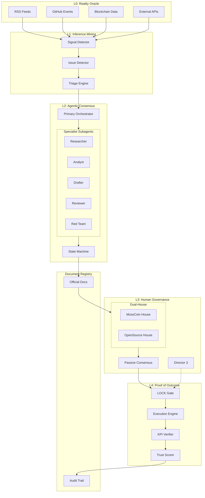
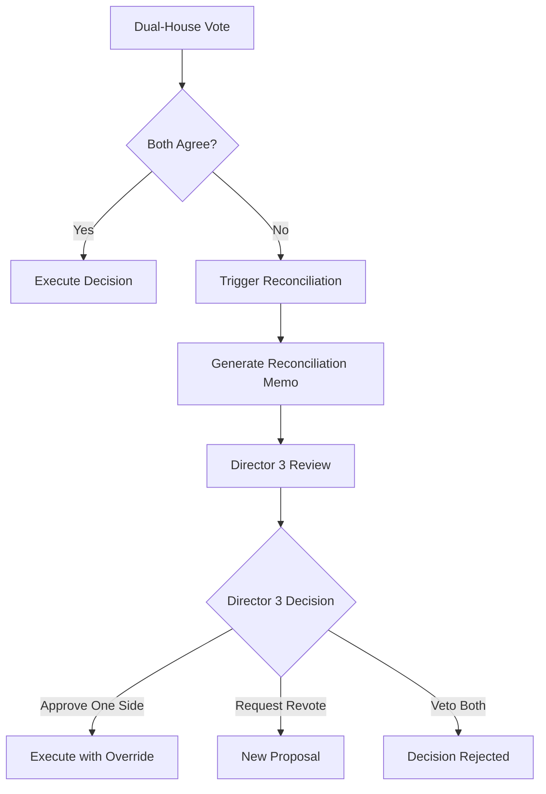

# Algora v2.0: Agentic AI-based Autonomous Governance Operating System
## Complete Upgrade Plan

**Version**: 2.0.0-plan
**Date**: 2026-01-12
**Status**: Ready for Review

[한국어 문서 (Korean)](./algora-v2-upgrade-plan.ko.md)

---

# A. Executive Summary

## North Star
> **Transform Algora from a "discussion visualization platform" into a "document-authority autonomous governance operating system" where AI agents continuously produce official outputs, humans govern by exception (Passive Consensus), and all dangerous effects remain locked until explicit approval.**

## Key Paradigm Shifts

### 1. Discussion Platform → Document-Authority Governance OS
- **Before**: Agents discuss issues; humans manually decide
- **After**: Agents produce official documents (Decision Packets, Proposals, Reports); documents have authority unless vetoed

### 2. Opt-In → Opt-Out (Passive Consensus) Model
- **Before**: Proposals require explicit human approval to pass
- **After**: Proposals auto-execute after review period unless vetoed or flagged for required review

### 3. Physical AI Vision for Mossland
- AI governance extends to real-world metaverse assets
- Ecosystem expansion decisions affect physical/virtual hybrid properties
- Decision Packets can trigger real-world actions (fund disbursement, partnership agreements)

## Core Guarantee: Safe Autonomy
The system **never stops** operating. Dangerous effects (execution, payouts, contracts, external actions) remain **LOCKED** until explicit human approval. The system continues to deliberate, document, and queue actions while awaiting approval.

---

# B. Authority & Artifact Definitions

## B.1 Official vs Non-Official Outputs

| Output Type | Authority Level | Binding? | Human Review |
|-------------|-----------------|----------|--------------|
| **Official Document** | Governance Authority | Yes, after approval period | Required for HIGH-risk |
| **Non-Official Output** | Informational Only | No | Optional |

## B.2 Official Document Types

| Document Type | Code | Description | Produces |
|---------------|------|-------------|----------|
| Decision Packet | `DP` | Comprehensive analysis with recommendation | Proposal or Action |
| Governance Proposal | `GP` | Formal voting item | Execution Plan |
| Resolution Memo | `RM` | Passed proposal summary | Execution Order |
| Reconciliation Memo | `RC` | Dual-house conflict resolution | Unified Decision |
| Working Group Charter | `WGC` | Official WG formation | Authority Grant |
| Ecosystem Report | `ER` | Periodic ecosystem analysis | Action Items |
| Developer Grant | `DG` | Approved funding allocation | Fund Disbursement |
| Partnership Agreement | `PA` | External collaboration terms | Commitments |
| Disclosure Report | `DR` | Transparency publication | Public Record |

## B.3 Non-Official Output Types

| Output Type | Purpose |
|-------------|---------|
| Agent Chatter | Ambient activity, no authority |
| Discussion Thread | Exploratory debate |
| Research Note | Background information |
| Signal Summary | Raw data aggregation |
| Draft Document | Work in progress |

## B.4 Provenance Requirements

All outputs must include:

```typescript
interface Provenance {
  documentId: string;           // Unique identifier (UUID v7)
  documentType: DocumentType;   // Official type code
  version: number;              // Semantic version
  createdAt: Date;              // ISO 8601 timestamp
  createdBy: {
    agentId: string;            // Orchestrator or specialist
    modelUsed: string;          // e.g., "qwen2.5:32b"
    taskId: string;             // Trace ID
  };
  sourceSignals: string[];      // Signal IDs that informed this
  parentDocuments: string[];    // Derived from which docs
  contentHash: string;          // SHA-256 of content
  approvalStatus: ApprovalStatus;
  reviewHistory: ReviewRecord[];
}

type ApprovalStatus =
  | 'DRAFT'
  | 'PENDING_REVIEW'
  | 'REVIEWED_APPROVED'
  | 'REVIEWED_REJECTED'
  | 'UNREVIEWED_AUTO_APPROVED'  // Passive Consensus
  | 'LOCKED_PENDING_APPROVAL';

interface ReviewRecord {
  reviewerId: string;           // Human or agent
  reviewerType: 'human' | 'agent';
  action: 'approve' | 'reject' | 'request_changes' | 'escalate';
  timestamp: Date;
  comments?: string;
}
```

---

# C. Core Operating Principles: Safe Autonomy

## C.1 The Four Safe Autonomy Principles

### Principle 1: The System Never Stops
- All operations are designed with delay-retry behavior
- If blocked, the system queues work and continues other tasks
- Heartbeat every 30 seconds confirms system liveness
- On failure, graceful degradation to Tier 1 (local LLM)

### Principle 2: Dangerous Effects Are Always LOCKED
- **LOCKED actions** cannot execute until explicit human approval
- LOCK categories: Fund transfers, External API calls, Contract deployments, Partnership commitments
- LOCKED items are queued with full context for review

### Principle 3: Transparency by Default
- All agent actions logged with full provenance
- "Unreviewed by Human" label on auto-approved items
- Public disclosure of all official documents
- Audit trail is immutable

### Principle 4: Human Override at Any Time
- Any human can escalate any item to Director 3
- Veto power remains with governance participants
- Emergency stop capability (pauses new actions, does not stop system)

## C.2 Human Participation Policy

### Director 3 Priority Routing
Director 3 is the highest priority human reviewer. All HIGH-risk items are routed to Director 3 first.

```typescript
interface RoutingPolicy {
  riskLevel: 'LOW' | 'MID' | 'HIGH';
  routeTo: 'auto' | 'any_reviewer' | 'director_3';
  reviewRequired: boolean;
  timeoutAction: 'auto_approve' | 'escalate' | 'reject';
  timeoutHours: number;
}

const ROUTING_RULES: RoutingPolicy[] = [
  { riskLevel: 'LOW', routeTo: 'auto', reviewRequired: false, timeoutAction: 'auto_approve', timeoutHours: 24 },
  { riskLevel: 'MID', routeTo: 'any_reviewer', reviewRequired: false, timeoutAction: 'auto_approve', timeoutHours: 48 },
  { riskLevel: 'HIGH', routeTo: 'director_3', reviewRequired: true, timeoutAction: 'escalate', timeoutHours: 72 },
];
```

### Recommended vs Required Review

| Risk Level | Review Type | Timeout Behavior |
|------------|-------------|------------------|
| LOW | Recommended | Auto-approve after 24h |
| MID | Recommended | Auto-approve after 48h with "Unreviewed" label |
| HIGH | **Required** | Escalate to Director 3; remains LOCKED until approved |

### "Unreviewed by Human" Labeling
All documents that proceed without human review carry a visible label:
```
[UNREVIEWED BY HUMAN] This document was auto-approved via Passive Consensus.
Review history: None. Escalate: [Button]
```

### "Pending Approval" Behavior
When an action is LOCKED:
1. Full context is preserved in the queue
2. Reminder notifications sent at 24h, 48h, 72h
3. System continues other work
4. On approval: execute immediately
5. On rejection: archive with rejection reason

### Execution Unlock Rule
**CRITICAL**: Execution unlock cannot occur without required approvals.
```typescript
function canExecute(action: LockedAction): boolean {
  if (action.riskLevel !== 'HIGH') return true;
  return action.approvals.some(a =>
    a.reviewerType === 'human' &&
    a.action === 'approve' &&
    a.reviewerId === 'director_3' // or designated approver
  );
}
```

---

# D. End-to-End Governance OS Pipeline

## D.1 Pipeline Overview

```
Signal → Issue → Orchestrated Review → Decision Packet → Official Docs
                                              ↓
                              (LOCKED) Execution → Outcome Proof
```

## D.2 Pipeline Stages

| Stage | Input | Output | LOCK Status |
|-------|-------|--------|-------------|
| Signal Collection | External sources | Normalized signals | N/A |
| Issue Detection | Signals | Issue record | N/A |
| Orchestrated Review | Issue | Research + Analysis | N/A |
| Decision Packet | Analysis | Official DP | N/A |
| Proposal Creation | DP | Governance Proposal | N/A |
| Voting/Approval | Proposal | Resolution | N/A |
| Execution | Resolution | Action | **LOCKED if HIGH-risk** |
| Outcome Proof | Execution | KPI Verification | N/A |

## D.3 Architecture Diagram



---

# E. Orchestrator System

## E.1 Primary Orchestrator Responsibilities

The **Primary Orchestrator** is the central coordinator for all governance workflows:

1. **Issue Intake**: Receives issues from L1, assigns workflow type
2. **Workflow Dispatch**: Routes to appropriate workflow (A-E)
3. **Specialist Coordination**: Summons and directs specialist subagents
4. **TODO Continuation**: Maintains work queue, never drops tasks
5. **State Management**: Tracks issue through all states
6. **Document Production**: Ensures all outputs have provenance
7. **Human Routing**: Escalates to appropriate human reviewer

## E.2 Specialist Subagents

Each specialist has a **fixed, narrow deliverable**:

| Specialist | Code | Deliverable | Max Tokens |
|------------|------|-------------|------------|
| Researcher | `RES` | Research Brief (5-10 sources) | 2000 |
| Analyst | `ANA` | Analysis Report (pros/cons/risks) | 3000 |
| Drafter | `DRA` | Document Draft (per template) | 4000 |
| Reviewer | `REV` | Review Report (issues/improvements) | 1500 |
| Red Team | `RED` | Adversarial Analysis (attack vectors) | 2000 |
| Summarizer | `SUM` | Executive Summary (3 bullets) | 500 |
| Translator | `TRN` | Korean Translation | Variable |
| Archivist | `ARC` | Registry Entry | 500 |

## E.3 TODO Continuation Guardrail

The Orchestrator maintains a persistent TODO list:

```typescript
interface OrchestratorTodo {
  id: string;
  issueId: string;
  workflowType: 'A' | 'B' | 'C' | 'D' | 'E';
  currentState: WorkflowState;
  pendingTasks: Task[];
  blockedBy?: string;          // Reason if blocked
  retryCount: number;
  lastAttempt: Date;
  nextAttempt: Date;           // Exponential backoff
}

// Guardrail: TODO list is persisted to database
// On restart, Orchestrator resumes all pending TODOs
```

## E.4 Issue Workflow State Machine

```
INTAKE → TRIAGE → RESEARCH → DELIBERATION → DECISION_PACKET
                                                    ↓
         (EXEC_LOCKED) ← PUBLISH ← REVIEW ←────────┘
              ↓
         OUTCOME_PROOF
```

### State Definitions

| State | Description | Exit Criteria |
|-------|-------------|---------------|
| `INTAKE` | Issue received, workflow assigned | Workflow type determined |
| `TRIAGE` | Priority scored, agents selected | PriorityScore computed |
| `RESEARCH` | Background research gathered | Research Brief complete |
| `DELIBERATION` | Agents debate options | Consensus or timeout |
| `DECISION_PACKET` | Formal DP drafted | DP passes validation |
| `REVIEW` | Human review (if required) | Approved/Rejected/Changes |
| `PUBLISH` | Document registered | Registry entry created |
| `EXEC_LOCKED` | Execution pending approval | Approval received |
| `OUTCOME_PROOF` | Results verified | KPIs measured |

### Acceptance Criteria per State

```typescript
const STATE_ACCEPTANCE: Record<WorkflowState, AcceptanceCriteria> = {
  INTAKE: {
    required: ['issueId', 'source', 'timestamp'],
    validation: (issue) => issue.title.length > 10,
  },
  TRIAGE: {
    required: ['priorityScore', 'workflowType', 'selectedAgents'],
    validation: (ctx) => ctx.priorityScore >= 0 && ctx.priorityScore <= 200,
  },
  RESEARCH: {
    required: ['researchBrief', 'sources'],
    validation: (ctx) => ctx.sources.length >= 3,
  },
  DELIBERATION: {
    required: ['agentOpinions', 'consensusScore'],
    validation: (ctx) => ctx.agentOpinions.length >= 3,
  },
  DECISION_PACKET: {
    required: ['options', 'recommendation', 'provenance'],
    validation: (dp) => dp.options.length >= 3 && dp.provenance.contentHash,
  },
  REVIEW: {
    required: ['reviewStatus'],
    validation: (ctx) => ['approved', 'rejected', 'changes_requested'].includes(ctx.reviewStatus),
  },
  PUBLISH: {
    required: ['registryId', 'publishedAt'],
    validation: (ctx) => ctx.registryId.startsWith('DOC-'),
  },
  EXEC_LOCKED: {
    required: ['lockReason', 'requiredApprovals'],
    validation: (ctx) => ctx.requiredApprovals.length > 0,
  },
  OUTCOME_PROOF: {
    required: ['kpiResults', 'trustScoreUpdates'],
    validation: (ctx) => ctx.kpiResults.every(k => k.measured !== undefined),
  },
};
```

## E.5 Delay-Retry Behavior

```typescript
const RETRY_CONFIG = {
  maxRetries: 10,
  initialDelayMs: 1000,
  maxDelayMs: 3600000,  // 1 hour max
  backoffMultiplier: 2,
};

async function executeWithRetry(task: Task): Promise<Result> {
  let delay = RETRY_CONFIG.initialDelayMs;
  for (let attempt = 0; attempt < RETRY_CONFIG.maxRetries; attempt++) {
    try {
      return await executeTask(task);
    } catch (error) {
      if (!isRetryable(error)) throw error;
      await sleep(delay);
      delay = Math.min(delay * RETRY_CONFIG.backoffMultiplier, RETRY_CONFIG.maxDelayMs);
      logRetry(task, attempt, error);
    }
  }
  // After max retries, queue for human review
  return escalateToHuman(task);
}
```

## E.6 Tool Permissions & Budgets

| Tool Category | Permission | Budget | High-Risk LOCK |
|---------------|------------|--------|----------------|
| Read Signal DB | All agents | Unlimited | No |
| Write Document | Orchestrator, Drafter | Unlimited | No |
| LLM Tier 1 | All agents | Unlimited | No |
| LLM Tier 2 | Orchestrator, Analysts | $10/day | No |
| External API | Operatives only | Rate limited | Yes |
| Fund Transfer | None (LOCKED) | N/A | **Always LOCKED** |
| Contract Deploy | None (LOCKED) | N/A | **Always LOCKED** |
| Partnership Commit | None (LOCKED) | N/A | **Always LOCKED** |

---

# F. Triage, Scoring, and Dynamic Routing

## F.1 PriorityScore Formula

```
PriorityScore = TopicWeight + Impact + Urgency + Feasibility − RiskPenalty
```

### Score Ranges
- **Total Range**: 0-200 points
- **High Priority**: ≥100
- **Medium Priority**: 50-99
- **Low Priority**: <50

## F.2 TopicWeight Values

| Topic Category | Weight | Rationale |
|----------------|--------|-----------|
| Mossland Expansion | +100 | Core mission alignment |
| Blockchain/AI Ecosystem | +60 | Strategic technology focus |
| Community/Governance | +40 | Stakeholder engagement |
| Technical/Infrastructure | +30 | Operational necessity |
| Open/General | +20 | Baseline coverage |

## F.3 Impact, Urgency, Feasibility Scoring

```typescript
interface ScoringFactors {
  impact: {
    revenue_potential: 0 | 10 | 20 | 30;       // Financial impact
    user_base_affected: 0 | 5 | 10 | 15;       // Scope of effect
    strategic_alignment: 0 | 5 | 10 | 15;      // Mission fit
  };
  urgency: {
    time_sensitivity: 0 | 10 | 20;             // Deadline proximity
    competitive_pressure: 0 | 5 | 10;          // Market timing
    dependency_blocking: 0 | 5 | 10;           // Blocks other work
  };
  feasibility: {
    technical_readiness: 0 | 5 | 10;           // Can we build it?
    resource_availability: 0 | 5 | 10;         // Do we have capacity?
    clear_requirements: 0 | 5 | 10;            // Is scope defined?
  };
}
```

## F.4 RiskPenalty Behavior

```typescript
interface RiskPenalty {
  securityRisk: 0 | -10 | -20 | -30;           // Security concerns
  complianceRisk: 0 | -10 | -20 | -30;         // Regulatory issues
  reputationalRisk: 0 | -5 | -10 | -20;        // PR concerns
  reversibilityRisk: 0 | -5 | -10 | -20;       // Can we undo it?
}

// HIGH RiskPenalty (≤-50) triggers automatic LOCK
function shouldLock(riskPenalty: number): boolean {
  return riskPenalty <= -50;
}
```

## F.5 Role-Based Dynamic Summoning

The Orchestrator summons agents based on issue category and priority:

```typescript
const SUMMONING_MATRIX: Record<string, AgentSummon[]> = {
  'mossland_expansion': [
    { agentCluster: 'Visionaries', count: 2, required: true },
    { agentCluster: 'Partnerships', count: 2, required: true },
    { agentCluster: 'Strategists', count: 1, required: true },
    { agentCluster: 'RedTeam', count: 1, required: false },
  ],
  'security_vulnerability': [
    { agentCluster: 'Guardians', count: 3, required: true },
    { agentCluster: 'Builders', count: 2, required: true },
    { agentCluster: 'RedTeam', count: 2, required: true },
  ],
  'tokenomics_treasury': [
    { agentCluster: 'Token & Incentives', count: 2, required: true },
    { agentCluster: 'Investors', count: 2, required: true },
    { agentCluster: 'Risk & Compliance', count: 1, required: true },
  ],
  'developer_program': [
    { agentCluster: 'Builders', count: 3, required: true },
    { agentCluster: 'Community', count: 1, required: true },
    { agentCluster: 'Product & UX', count: 1, required: false },
  ],
  // ... additional categories
};
```

---

# G. Five Fixed Workflows (A-E)

## G.1 Workflow A: Agentic AI Academic Activity

### Purpose
Research and synthesize AI/blockchain academic developments relevant to Mossland ecosystem.

### Inputs
- Academic paper signals (arXiv, conferences)
- AI lab announcements
- Research trends

### State Machine Mapping
```
INTAKE → TRIAGE → RESEARCH → DELIBERATION → DECISION_PACKET → REVIEW → PUBLISH
```

### Official Outputs
- **Research Digest** (weekly): Curated summaries
- **Technology Assessment** (on significant findings): Deep analysis

### Non-Official Outputs
- Literature review notes
- Agent discussion threads

### LOCK Rules
- No LOCKs (informational only)

### Human Review Rules
- **Recommended** for Technology Assessments
- **Not Required** for Research Digests

### Specialist Agents
| Agent | Deliverable |
|-------|-------------|
| Researcher | Paper summaries, source extraction |
| Analyst | Relevance scoring, trend identification |
| Summarizer | Executive digest |
| Translator | Korean version |

---

## G.2 Workflow B: Agentic AI Free Debate

### Purpose
Open-ended deliberation on strategic questions, community proposals, or exploratory topics.

### Inputs
- Community-submitted topics
- Agent-initiated questions
- Strategic queries

### State Machine Mapping
```
INTAKE → TRIAGE → DELIBERATION → DECISION_PACKET (optional) → PUBLISH
```

### Official Outputs
- **Debate Summary**: Synthesis of arguments
- **Decision Packet** (if consensus reached): Formal recommendation

### Non-Official Outputs
- Discussion threads
- Agent opinions

### LOCK Rules
- No LOCKs (debate is non-binding)

### Human Review Rules
- **Not Required** (exploratory)
- Humans may participate in debate

### Specialist Agents
| Agent | Deliverable |
|-------|-------------|
| Moderator | Facilitate discussion, identify consensus |
| Summarizer | Debate summary |
| Red Team | Challenge assumptions |

---

## G.3 Workflow C: Mossland Developer Support Program

### Purpose
Manage developer grants with Dual-House approval and retroactive rewards.

### Inputs
- Grant applications
- Developer milestone reports
- Retroactive reward nominations

### State Machine Mapping
```
INTAKE → TRIAGE → RESEARCH → DELIBERATION → DECISION_PACKET
    → DUAL_HOUSE_REVIEW → PUBLISH → EXEC_LOCKED → OUTCOME_PROOF
```

### Official Outputs
- **Grant Proposal** (GP): Formal funding request
- **Developer Grant** (DG): Approved allocation
- **Milestone Report** (MR): Progress verification
- **Retroactive Reward** (RR): Post-hoc recognition

### Non-Official Outputs
- Application drafts
- Review comments

### LOCK Rules
- **LOCKED**: All fund disbursements
- Requires Dual-House approval

### Human Review Rules
- **Required**: All grants >$1,000
- **Required**: Retroactive rewards
- MossCoin House + OpenSource House must both approve

### Specialist Agents
| Agent | Deliverable |
|-------|-------------|
| Researcher | Application review, prior work analysis |
| Analyst | Budget feasibility, milestone clarity |
| Drafter | Grant proposal document |
| Archivist | Registry entry |

### Retroactive Reward Rules
```typescript
interface RetroactiveReward {
  nomineeId: string;
  contributionDescription: string;
  evidenceLinks: string[];
  proposedAmount: number;
  nominatedBy: string;          // Can be agent or human
  supportingVotes: number;      // Community endorsements
  approvalStatus: 'pending' | 'approved' | 'rejected';
}

// Eligibility: Contribution must be verifiable and post-date original grant
// Amount: Capped at 50% of original grant value
// Approval: Requires Dual-House + Director 3 for amounts >$5,000
```

---

## G.4 Workflow D: Mossland Ecosystem Expansion

### Purpose
Evaluate and onboard ecosystem expansion opportunities (partnerships, new projects, acquisitions).

### Inputs

#### Call-Based Intake
- Explicit proposals from external parties
- Internal strategic initiatives
- Board directives

#### Always-On Intake (Mandatory)
- Continuous signal scanning for opportunities
- Competitor monitoring
- Market trend detection

```typescript
interface AlwaysOnIntake {
  enabled: true;                // Mandatory
  scanInterval: '1h';           // Hourly scans
  signalSources: [
    'rss:partnerships',
    'blockchain:dex_listings',
    'social:twitter_mentions',
    'github:new_integrations',
  ];
  autoCreateIssue: true;        // Significant findings become issues
  significanceThreshold: 70;    // Score 0-100
}
```

### State Machine Mapping
```
ALWAYS_ON_SCAN → INTAKE → TRIAGE → RESEARCH → DELIBERATION
    → DECISION_PACKET → DUAL_HOUSE_REVIEW → PUBLISH
    → EXEC_LOCKED → OUTCOME_PROOF
```

### Official Outputs
- **Opportunity Assessment** (OA): Initial evaluation
- **Partnership Proposal** (PP): Formal engagement plan
- **Partnership Agreement** (PA): Binding terms (LOCKED)
- **Ecosystem Report** (ER): Periodic status

### Non-Official Outputs
- Market scans
- Competitor analysis drafts

### LOCK Rules
- **LOCKED**: Partnership Agreements
- **LOCKED**: Any financial commitments
- **LOCKED**: External communications on behalf of Mossland

### Human Review Rules
- **Required**: All Partnership Proposals
- **Required**: All agreements
- Director 3 approval for commitments >$10,000

### Origin Tracking
```typescript
interface ExpansionIssue extends Issue {
  origin: 'call_based' | 'always_on';
  sourceSignal?: string;        // If always_on, which signal triggered
  escalatedFromScan?: boolean;  // If always_on scan became formal proposal
}
```

### Anti-Spam/Abuse Guardrails
```typescript
const ALWAYS_ON_GUARDRAILS = {
  maxIssuesPerDay: 10,          // Rate limit
  deduplicationWindow: '7d',    // Don't resurface same topic
  minimumSignalQuality: 50,     // Filter low-quality signals
  requireMultipleSources: 2,    // Corroboration requirement
  cooldownAfterRejection: '30d',// Don't resurface rejected topics
  humanEscalationThreshold: 3,  // Auto-escalate after 3 similar signals
};
```

### Optional: Proposal → Derived Call Escalation
If an always_on issue reaches DECISION_PACKET with a strong recommendation, it can be escalated to a formal Call:
```typescript
interface DerivedCall {
  originalIssueId: string;
  escalatedAt: Date;
  escalatedBy: 'orchestrator' | 'human';
  callType: 'formal_rfp' | 'partnership_outreach' | 'internal_initiative';
  priorityBoost: number;        // +30 to PriorityScore
}
```

### Specialist Agents
| Agent | Deliverable |
|-------|-------------|
| Scout | Opportunity identification |
| Researcher | Due diligence, background |
| Analyst | Risk/reward analysis |
| Strategist | Alignment assessment |
| Drafter | Proposal/agreement drafts |
| Red Team | Counter-party risk analysis |

---

## G.5 Workflow E: Working Groups

### Purpose
Form and manage official Working Groups with publishing authority.

### Inputs
- WG formation proposals
- WG charter renewals
- WG dissolution requests

### State Machine Mapping
```
INTAKE → TRIAGE → DELIBERATION → DECISION_PACKET
    → DUAL_HOUSE_REVIEW → PUBLISH (WG Charter) → ACTIVE_WG
```

### Always-On Creation
Working Groups can be proposed by:
- The Orchestrator (based on recurring issue patterns)
- Community members
- Existing WGs

```typescript
interface WorkingGroupProposal {
  name: string;
  purpose: string;
  scope: string[];              // Topic areas
  chairAgent: string;           // Lead agent
  memberAgents: string[];       // Initial members
  humanLiaison?: string;        // Optional human sponsor
  charterDuration: '6m' | '1y' | 'indefinite';
  publishingAuthority: DocumentType[]; // What docs can they publish
  budget?: number;              // Optional funding
}
```

### Official Outputs
- **Working Group Charter** (WGC): Formation document
- WG-published documents (per charter authority)
- WG Status Reports

### Non-Official Outputs
- WG meeting notes
- Internal discussions

### LOCK Rules
- **LOCKED**: WG budget allocations
- **Not Locked**: WG document publishing (within charter scope)

### Human Review Rules
- **Required**: WG formation
- **Required**: Charter amendments
- **Not Required**: Routine WG publications (if within scope)

### Publishing Authority
WGs can publish official documents without full governance cycle:
```typescript
interface WGPublishingRules {
  allowedDocTypes: DocumentType[];
  requiresWGConsensus: boolean;  // Majority of WG agents agree
  requiresHumanReview: boolean;  // Based on doc type
  cooldownBetweenDocs: string;   // e.g., '24h'
  maxDocsPerWeek: number;
}
```

### Specialist Agents
| Agent | Deliverable |
|-------|-------------|
| Moderator | WG facilitation |
| Drafter | Charter, reports |
| Archivist | Document registration |

---

# H. Official Document Registry (Critical)

## H.1 Standardized Document Types

```typescript
enum DocumentType {
  // Decision Documents
  DECISION_PACKET = 'DP',
  GOVERNANCE_PROPOSAL = 'GP',
  RESOLUTION_MEMO = 'RM',
  RECONCILIATION_MEMO = 'RC',

  // Working Group Documents
  WG_CHARTER = 'WGC',
  WG_REPORT = 'WGR',

  // Ecosystem Documents
  ECOSYSTEM_REPORT = 'ER',
  PARTNERSHIP_PROPOSAL = 'PP',
  PARTNERSHIP_AGREEMENT = 'PA',

  // Developer Program Documents
  GRANT_PROPOSAL = 'DGP',
  DEVELOPER_GRANT = 'DG',
  MILESTONE_REPORT = 'MR',
  RETROACTIVE_REWARD = 'RR',

  // Transparency Documents
  DISCLOSURE_REPORT = 'DR',
  AUDIT_REPORT = 'AR',

  // Research Documents
  RESEARCH_DIGEST = 'RD',
  TECHNOLOGY_ASSESSMENT = 'TA',
}
```

## H.2 Versioning and State Model

```typescript
interface DocumentVersion {
  major: number;    // Breaking changes
  minor: number;    // Additions
  patch: number;    // Fixes
}

enum DocumentState {
  DRAFT = 'draft',
  PENDING_REVIEW = 'pending_review',
  IN_REVIEW = 'in_review',
  APPROVED = 'approved',
  PUBLISHED = 'published',
  SUPERSEDED = 'superseded',    // Replaced by newer version
  ARCHIVED = 'archived',        // No longer active
  REJECTED = 'rejected',
}

interface DocumentStateTransition {
  from: DocumentState;
  to: DocumentState;
  trigger: string;
  actor: 'agent' | 'human' | 'system';
  timestamp: Date;
  reason?: string;
}
```

## H.3 Immutable Audit Trail

```typescript
interface AuditEntry {
  id: string;                   // UUID v7
  documentId: string;
  action: AuditAction;
  actor: {
    id: string;
    type: 'agent' | 'human' | 'system';
  };
  timestamp: Date;
  previousState?: DocumentState;
  newState?: DocumentState;
  contentHashBefore?: string;
  contentHashAfter?: string;
  metadata: Record<string, unknown>;
}

enum AuditAction {
  CREATED = 'created',
  UPDATED = 'updated',
  STATE_CHANGED = 'state_changed',
  REVIEWED = 'reviewed',
  APPROVED = 'approved',
  REJECTED = 'rejected',
  PUBLISHED = 'published',
  ACCESSED = 'accessed',
  EXPORTED = 'exported',
}
```

## H.4 Metadata Schema

```typescript
interface DocumentMetadata {
  id: string;                   // DOC-{type}-{YYYYMMDD}-{seq}
  type: DocumentType;
  title: string;
  summary: string;              // Max 500 chars
  version: DocumentVersion;
  state: DocumentState;

  // Provenance
  createdAt: Date;
  createdBy: string;            // Agent or human ID
  modifiedAt: Date;
  modifiedBy: string;

  // Relationships
  issueId?: string;             // Source issue
  parentDocuments: string[];    // Derived from
  childDocuments: string[];     // Has derived
  relatedWorkflow: WorkflowType;

  // Content
  contentHash: string;          // SHA-256
  contentSize: number;          // Bytes
  language: 'en' | 'ko';
  hasTranslation: boolean;
  translationId?: string;

  // Access
  accessLevel: 'public' | 'governance' | 'internal';
  reviewRequired: boolean;
  approvedBy?: string[];

  // Indexing
  tags: string[];
  categories: string[];
  mentionedAgents: string[];
  mentionedProposals: string[];
}
```

## H.5 Provenance Schema

```typescript
interface FullProvenance extends Provenance {
  // Chain of custody
  creationContext: {
    issueId: string;
    workflowType: WorkflowType;
    triggerSignals: string[];
    orchestratorTaskId: string;
  };

  // Agent contributions
  agentContributions: {
    agentId: string;
    role: string;               // e.g., 'researcher', 'drafter'
    modelUsed: string;
    tokenCount: number;
    costUsd: number;
    outputHash: string;
  }[];

  // Review chain
  reviewChain: {
    reviewerId: string;
    reviewerType: 'agent' | 'human';
    action: 'approve' | 'reject' | 'modify';
    timestamp: Date;
    signature?: string;         // For human reviewers
  }[];

  // Verification
  integrityProof: {
    algorithm: 'sha256';
    hash: string;
    signedBy?: string;
    signatureTimestamp?: Date;
  };
}
```

---

# I. Decision Packet (Enforced)

## I.1 Mandatory Fields

Every Decision Packet MUST include:

| Field | Required | Description |
|-------|----------|-------------|
| Issue | Yes | The problem being addressed |
| Evidence | Yes | Supporting data and signals |
| Options (≥3) | Yes | At least 3 distinct alternatives |
| Trade-offs | Yes | Pros/cons for each option |
| Risks | Yes | Risk assessment per option |
| Counterarguments | Yes | Devil's advocate analysis |
| Recommendation | Yes | Orchestrator's preferred option |
| Execution Plan | Yes | Implementation steps |
| Approvals & Locks | Yes | Required approvals, LOCK status |
| KPIs | Yes | Success metrics |
| Provenance | Yes | Full provenance chain |

## I.2 Markdown Template

```markdown
# Decision Packet: {DP-YYYYMMDD-NNN}

## Document Metadata
- **Type**: Decision Packet
- **Version**: {major}.{minor}.{patch}
- **State**: {state}
- **Created**: {ISO timestamp}
- **Author**: {Orchestrator ID}

## 1. Issue Summary
### 1.1 Title
{Issue title}

### 1.2 Description
{Detailed description of the issue}

### 1.3 Source Signals
| Signal ID | Source | Severity | Timestamp |
|-----------|--------|----------|-----------|
| {id} | {source} | {severity} | {timestamp} |

### 1.4 Priority Score
- **Total Score**: {score}/200
- **Topic Weight**: {topicWeight}
- **Impact**: {impact}
- **Urgency**: {urgency}
- **Feasibility**: {feasibility}
- **Risk Penalty**: {riskPenalty}

## 2. Evidence
### 2.1 Research Brief
{Synthesized research from Researcher agent}

### 2.2 Data Sources
| Source | Type | Reliability | Link |
|--------|------|-------------|------|
| {name} | {type} | {score}/100 | {url} |

### 2.3 Historical Context
{Relevant past decisions or precedents}

## 3. Options Analysis

### Option A: {Option Name}
**Description**: {What this option entails}

**Trade-offs**:
| Pro | Con |
|-----|-----|
| {pro1} | {con1} |
| {pro2} | {con2} |

**Risks**:
- {risk1}: {severity} / {mitigation}
- {risk2}: {severity} / {mitigation}

**Estimated Cost**: {cost}
**Estimated Timeline**: {timeline}

### Option B: {Option Name}
{Same structure as Option A}

### Option C: {Option Name}
{Same structure as Option A}

## 4. Counterarguments
### 4.1 Against Recommendation
{Red Team analysis of the recommended option}

### 4.2 Alternative Perspectives
| Agent | Perspective | Confidence |
|-------|-------------|------------|
| {agent} | {view} | {score}% |

## 5. Recommendation
### 5.1 Recommended Option
**{Option X}** is recommended because:
1. {reason1}
2. {reason2}
3. {reason3}

### 5.2 Confidence Level
- **Orchestrator Confidence**: {score}%
- **Agent Consensus**: {score}%
- **Data Quality**: {score}%

## 6. Execution Plan
### 6.1 Steps
| Step | Action | Owner | Timeline | Dependencies |
|------|--------|-------|----------|--------------|
| 1 | {action} | {owner} | {time} | {deps} |
| 2 | {action} | {owner} | {time} | {deps} |

### 6.2 Resource Requirements
- **Budget**: {amount}
- **Personnel**: {requirements}
- **Technology**: {requirements}

## 7. Approvals & Locks
### 7.1 Required Approvals
| Approval Type | Required | Status |
|---------------|----------|--------|
| MossCoin House | {yes/no} | {status} |
| OpenSource House | {yes/no} | {status} |
| Director 3 | {yes/no} | {status} |

### 7.2 LOCK Status
- **Execution LOCKED**: {yes/no}
- **Lock Reason**: {reason}
- **Unlock Requirements**: {requirements}

## 8. KPIs
| Metric | Target | Measurement Method | Timeline |
|--------|--------|-------------------|----------|
| {metric} | {target} | {method} | {timeline} |

## 9. Provenance
- **Document ID**: {DP-YYYYMMDD-NNN}
- **Content Hash**: {sha256}
- **Issue ID**: {issue_id}
- **Workflow**: {workflow_type}
- **Agent Contributions**: {list}
- **Model Used**: {model}
- **Total Tokens**: {count}
- **Total Cost**: ${cost}

---
**Generated by Algora Orchestrator v2.0**
**Unreviewed by Human**: {yes/no}
```

## I.3 JSON/Type Schema

```typescript
interface DecisionPacket {
  // Metadata
  id: string;                   // DP-YYYYMMDD-NNN
  version: DocumentVersion;
  state: DocumentState;
  createdAt: Date;
  modifiedAt: Date;

  // Issue
  issue: {
    id: string;
    title: string;
    description: string;
    category: string;
    sourceSignals: SignalReference[];
    priorityScore: PriorityScore;
  };

  // Evidence
  evidence: {
    researchBrief: string;
    dataSources: DataSource[];
    historicalContext: string;
  };

  // Options (minimum 3)
  options: DecisionOption[];    // length >= 3

  // Counterarguments
  counterarguments: {
    againstRecommendation: string;
    alternativePerspectives: AgentPerspective[];
  };

  // Recommendation
  recommendation: {
    optionId: string;
    reasons: string[];
    confidence: {
      orchestrator: number;     // 0-100
      agentConsensus: number;   // 0-100
      dataQuality: number;      // 0-100
    };
  };

  // Execution
  executionPlan: {
    steps: ExecutionStep[];
    resourceRequirements: ResourceRequirements;
  };

  // Approvals
  approvalsAndLocks: {
    requiredApprovals: ApprovalRequirement[];
    lockStatus: {
      isLocked: boolean;
      lockReason?: string;
      unlockRequirements?: string[];
    };
  };

  // KPIs
  kpis: KPI[];

  // Provenance
  provenance: FullProvenance;
}

interface DecisionOption {
  id: string;
  name: string;
  description: string;
  tradeoffs: {
    pros: string[];
    cons: string[];
  };
  risks: Risk[];
  estimatedCost: number;
  estimatedTimeline: string;
}

interface ValidationRules {
  requiredFields: (keyof DecisionPacket)[];
  minimumOptions: 3;
  minimumSignals: 1;
  minimumAgentPerspectives: 3;
  requiredProvenance: ['contentHash', 'createdBy', 'modelUsed'];
}
```

---

# J. Agent Clusters & Multi-Persona Diversity

## J.1 Expanded Agent Clusters

| Cluster | Count | Focus Area |
|---------|-------|------------|
| Orchestrators | 2 | Workflow coordination, task management |
| Archivists | 2 | Document registry, audit trails |
| Researchers | 4 | Academic research, due diligence |
| Strategists | 3 | Long-term planning, alignment |
| Scouts | 3 | Opportunity detection, market scanning |
| Builders | 5 | Engineering, implementation |
| Token & Incentives | 3 | Tokenomics, rewards, treasury |
| Risk & Compliance | 4 | Security, legal, regulatory |
| Community & Content | 3 | Engagement, communications |
| Partnerships & Events | 3 | External relations, events |
| Product & UX | 3 | User experience, product design |
| Red Team | 3 | Adversarial analysis, stress testing |

**Total**: 38 agents (expanded from 30)

## J.2 Multi-Persona Examples per Cluster

### Orchestrators
| ID | Name | Persona | Signature |
|----|------|---------|-----------|
| `primary-orchestrator` | Nova Prime | Methodical, systems-focused | "Let me coordinate this systematically." |
| `backup-orchestrator` | Atlas | Resilient, fallback specialist | "I've got the backup plan ready." |

### Archivists
| ID | Name | Persona | Signature |
|----|------|---------|-----------|
| `registry-keeper` | Archive Alpha | Meticulous, version-obsessed | "Is the provenance complete?" |
| `audit-guardian` | Trace Master | Forensic, accountability-focused | "Every action leaves a trace." |

### Researchers
| ID | Name | Persona | Signature |
|----|------|---------|-----------|
| `academic-scout` | Scholar One | Academic, citation-focused | "Let me check the literature." |
| `tech-researcher` | Syntax Sage | Technical depth | "The implementation details matter." |
| `market-analyst` | Trend Tracker | Data-driven, quantitative | "The numbers tell a story." |
| `competitor-watch` | Rival Eye | Competitive intelligence | "What's the competition doing?" |

### Red Team
| ID | Name | Persona | Signature |
|----|------|---------|-----------|
| `devil-advocate` | Contrarian Carl | Always challenges consensus | "Have we considered the opposite?" |
| `security-attacker` | Breach Tester | Simulates attack vectors | "How would a malicious actor exploit this?" |
| `assumption-breaker` | Base Questioner | Challenges underlying assumptions | "Why do we assume that's true?" |

## J.3 Red Team Integration

Red Team agents are **mandatory participants** in:
- All HIGH-risk decisions
- Partnership evaluations
- Security-related issues
- Treasury allocation decisions

```typescript
interface RedTeamRequirement {
  minimumParticipation: number;  // At least 1 Red Team agent
  vetoThreshold: number;         // Confidence below this triggers escalation
  mandatoryCategories: string[]; // Always include Red Team
}

const RED_TEAM_CONFIG: RedTeamRequirement = {
  minimumParticipation: 1,
  vetoThreshold: 30,             // If Red Team confidence <30%, escalate
  mandatoryCategories: [
    'security',
    'treasury',
    'partnership',
    'high_risk',
  ],
};
```

---

# K. Local LLM Diversification & Difficulty-Based Routing

## K.1 Maintain 3-Tier LLM Strategy

| Tier | Cost | Use Cases | Fallback |
|------|------|-----------|----------|
| Tier 0 | Free | Data collection, no LLM | N/A |
| Tier 1 | Local | Chatter, simple analysis | Quality degradation |
| Tier 2 | External | Complex decisions, DP generation | Tier 1 fallback |

## K.2 Task-Based Model Lineup

| Task Type | Primary Model | Backup Model | Tier |
|-----------|---------------|--------------|------|
| Scouting | llama3.2:8b | phi4:14b | 1 |
| Debate | qwen2.5:14b | mistral-small-3:24b | 1 |
| Core Decision | qwen2.5:32b | qwen3:32b | 1+ |
| Coding | qwen2.5-coder:32b | deepseek-coder:33b | 1 |
| Vision | llama3.2-vision:11b | qwen2-vl:7b | 1 |
| Korean | qwen2.5:32b | exaone3.5:32b | 1 |
| Complex Analysis | claude-sonnet-4-20250514 | gpt-4o | 2 |

## K.3 RAG Stack

### Embeddings
| Model | Dimensions | Use Case |
|-------|------------|----------|
| nomic-embed-text | 768 | General text |
| mxbai-embed-large | 1024 | High-quality retrieval |
| bge-m3 | 1024 | Multilingual (EN/KO) |

### Rerankers
| Model | Use Case |
|-------|----------|
| bge-reranker-v2-m3 | Cross-lingual reranking |
| qwen3-reranker | Quality-focused reranking |

## K.4 Model Registry Design

```typescript
interface ModelRegistry {
  models: ModelEntry[];
  defaultModel: string;
  fallbackChain: string[];
}

interface ModelEntry {
  id: string;                   // e.g., "qwen2.5:32b"
  provider: 'ollama' | 'anthropic' | 'openai' | 'google';
  tier: 0 | 1 | 2;
  capabilities: ModelCapability[];
  contextWindow: number;
  tokensPerSecond: number;      // Benchmark on target hardware
  costPer1kTokens: number;      // 0 for local
  languages: string[];
  specializations: string[];    // e.g., ['coding', 'korean']
  status: 'available' | 'unavailable' | 'degraded';
  lastHealthCheck: Date;
}

enum ModelCapability {
  TEXT_GENERATION = 'text',
  CODE_GENERATION = 'code',
  VISION = 'vision',
  EMBEDDING = 'embedding',
  RERANKING = 'rerank',
  FUNCTION_CALLING = 'functions',
}
```

## K.5 Task Difficulty Classifier

```typescript
interface TaskDifficultyClassifier {
  classify(task: Task): DifficultyLevel;
}

enum DifficultyLevel {
  TRIVIAL = 'trivial',          // Chatter, simple lookups
  SIMPLE = 'simple',            // Single-step analysis
  MODERATE = 'moderate',        // Multi-step reasoning
  COMPLEX = 'complex',          // Expert-level analysis
  CRITICAL = 'critical',        // Decision Packets, high-stakes
}

interface ClassificationRules {
  trivial: {
    maxTokens: 500,
    examples: ['idle_chatter', 'greeting', 'simple_lookup'],
  },
  simple: {
    maxTokens: 1000,
    examples: ['summarize_signal', 'tag_content', 'translate_short'],
  },
  moderate: {
    maxTokens: 2000,
    examples: ['research_brief', 'option_analysis', 'risk_assessment'],
  },
  complex: {
    maxTokens: 4000,
    examples: ['decision_packet', 'full_deliberation', 'strategy_synthesis'],
  },
  critical: {
    maxTokens: 8000,
    examples: ['high_risk_decision', 'partnership_agreement', 'treasury_allocation'],
    requiresTier2: true,
  },
}
```

## K.6 Router Policy

```typescript
interface RouterPolicy {
  route(task: Task): ModelSelection;
}

interface ModelSelection {
  primaryModel: string;
  fallbackModels: string[];
  tier: 1 | 2;
  maxRetries: number;
  qualityGate: QualityGate;
}

interface QualityGate {
  enabled: boolean;
  minConfidence: number;        // 0-100
  requiresReview: boolean;
  escalateOnFailure: boolean;
}

const ROUTER_POLICY: Record<DifficultyLevel, ModelSelection> = {
  trivial: {
    primaryModel: 'llama3.2:8b',
    fallbackModels: ['phi4:14b'],
    tier: 1,
    maxRetries: 2,
    qualityGate: { enabled: false },
  },
  simple: {
    primaryModel: 'qwen2.5:14b',
    fallbackModels: ['mistral-small-3:24b', 'llama3.2:8b'],
    tier: 1,
    maxRetries: 2,
    qualityGate: { enabled: false },
  },
  moderate: {
    primaryModel: 'qwen2.5:32b',
    fallbackModels: ['mistral-small-3:24b'],
    tier: 1,
    maxRetries: 3,
    qualityGate: { enabled: true, minConfidence: 70, requiresReview: false },
  },
  complex: {
    primaryModel: 'qwen2.5:32b',
    fallbackModels: ['claude-sonnet-4-20250514'],
    tier: 1,                    // Try Tier 1 first
    maxRetries: 3,
    qualityGate: { enabled: true, minConfidence: 80, requiresReview: true, escalateOnFailure: true },
  },
  critical: {
    primaryModel: 'claude-sonnet-4-20250514',
    fallbackModels: ['gpt-4o', 'qwen2.5:72b'],
    tier: 2,                    // Always use Tier 2
    maxRetries: 5,
    qualityGate: { enabled: true, minConfidence: 90, requiresReview: true, escalateOnFailure: true },
  },
};
```

---

# L. Dual-House Governance

## L.1 House Definitions

### MossCoin House
- **Membership**: MOC token holders
- **Voting Power**: Token-weighted
- **Focus**: Financial decisions, treasury, tokenomics
- **Quorum**: 10% of circulating supply

### Mossland OpenSource House
- **Membership**: Active contributors (GitHub, community)
- **Voting Power**: Contribution-weighted (commits, PRs, community points)
- **Focus**: Technical decisions, roadmap, open source direction
- **Quorum**: 20% of active contributors

## L.2 Dual Approval as Default

Most decisions require approval from **both houses**:

```typescript
interface DualHouseVoting {
  proposalId: string;

  mossCoinHouse: {
    votesFor: number;           // Token-weighted
    votesAgainst: number;
    votesAbstain: number;
    quorumReached: boolean;
    passed: boolean;
  };

  openSourceHouse: {
    votesFor: number;           // Contribution-weighted
    votesAgainst: number;
    votesAbstain: number;
    quorumReached: boolean;
    passed: boolean;
  };

  overallStatus: 'pending' | 'both_passed' | 'moc_only' | 'oss_only' | 'rejected';
  requiresReconciliation: boolean;
}

function calculateOverallStatus(voting: DualHouseVoting): OverallStatus {
  if (voting.mossCoinHouse.passed && voting.openSourceHouse.passed) {
    return 'both_passed';
  }
  if (voting.mossCoinHouse.passed !== voting.openSourceHouse.passed) {
    return 'requires_reconciliation';
  }
  return 'rejected';
}
```

## L.3 Conflict Resolution

When houses disagree, a **Reconciliation Memo** process begins:



### Reconciliation Memo Contents
```typescript
interface ReconciliationMemo {
  proposalId: string;
  documentId: string;           // RC-YYYYMMDD-NNN

  conflictSummary: {
    mossCoinPosition: string;
    openSourcePosition: string;
    keyDisagreements: string[];
  };

  orchestratorAnalysis: {
    underlyingConcerns: string[];
    possibleCompromises: string[];
    recommendation: 'favor_moc' | 'favor_oss' | 'compromise' | 'reject_both';
    reasoning: string;
  };

  director3Decision?: {
    decision: 'override_moc' | 'override_oss' | 'revote' | 'veto';
    reasoning: string;
    conditions?: string[];
    timestamp: Date;
  };
}
```

## L.4 Mandatory LOCK + Approval for High-Risk

All HIGH-risk actions require:
1. Dual-House approval (both must pass)
2. Director 3 approval
3. Explicit UNLOCK command

```typescript
interface HighRiskApproval {
  proposalId: string;
  riskLevel: 'HIGH';

  approvals: {
    mossCoinHouse: boolean;
    openSourceHouse: boolean;
    director3: boolean;
  };

  lockStatus: 'LOCKED';

  canUnlock(): boolean {
    return this.approvals.mossCoinHouse &&
           this.approvals.openSourceHouse &&
           this.approvals.director3;
  }
}
```

---

# M-T. Additional Sections

For the complete document including:
- **M. Code & Package Upgrade Map (L0-L4)**
- **N. Phased Roadmap**
- **O. Operational KPIs**
- **P. Ollama Install Commands**
- **Q. Security, Risk & Compliance**
- **R. Testing & Validation**
- **S. Requirements Traceability Matrix**
- **T. Coverage Checklist**

Please refer to the full plan document. These sections detail the technical implementation, including database schemas, new packages, migration strategies, and comprehensive testing requirements.

---

**Document Status**: Approved
**Last Updated**: 2026-01-12
